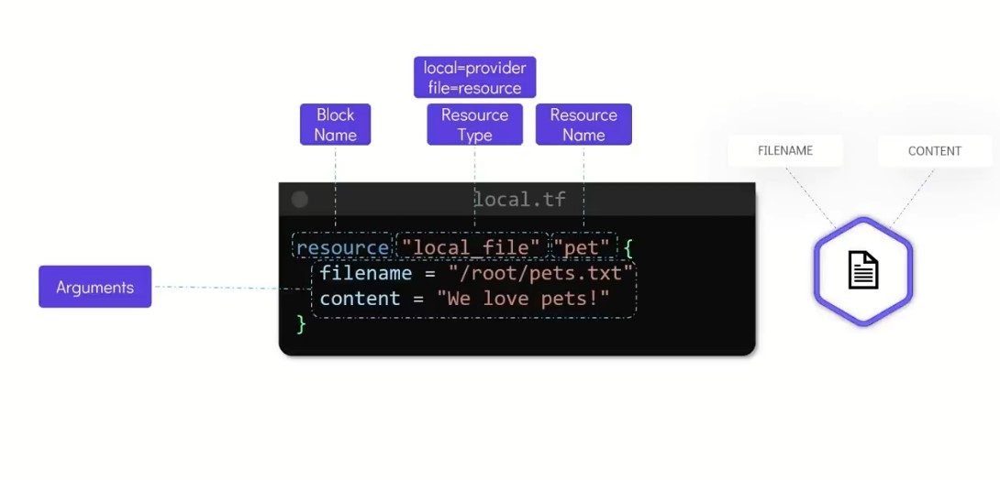
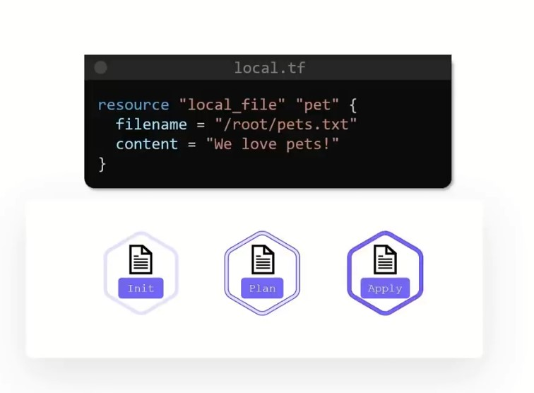
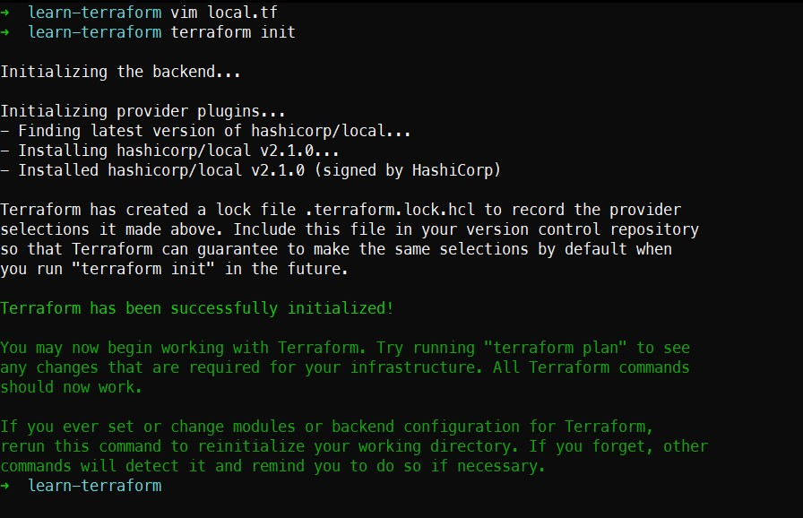

Credits - KodeKloud Terraform Course

- Types of IaC tool 
  - Configuration management (Ansible, puppet and salt stack)
  - Server templating  (docker, packer and vagrant)
  - provisioning tools (terraform, cloudformation)

Why terraform?
- Terraform is the first cloud native way of managing your infrastructure and it was earlier in the game of infrastructure as code. Later many other infrastructure as code platform have came in the market like crossplane, pulumi and others. All the three are open source projects and are under the provision of CNCF. 
- Since terraform was earlier in the game it have a lot of intergation with the big and even small cloud providers. 
- Terraform used a configuration language which is known as hashicorp configuration language(HCL)
- HCL is somewhat same as JSON but more human friendly in reading. 
- The resources are defined in a declrative fashion which means that you are only concerned about the final outcome of the infrastructure. You do not provide each and every steps to configure your infrastructure. 
- Think of declrative language as calling a Cab. You call the cab and you only tell the driver your destination and sit back and relax. On the other hand if you have your own car then what will you do is open a google map and then map will provide you step by step instruction at each and every chowk. 
- Terraform not only manages your compute instances. It also manages the follwings:
1. cloud platforms - aws, azure, GCP
2. Networking infrastructure - Palo Alto, Infoblox, BigIP
3. monitoring and data management tools - DataDog, Grafana, Sumologic
4. databases - InfluxDB, mongoDB, postgreSQL


### How does terraform manage to connect to all the cloud providers out there?
- This is achieved through providers. A Providers help terraform manage third party platforms through their API.

### .tf files
- you can write your infrastructure in this file format and share and version that infrastructure. 
- when you will create a .tf file and then do `terraform init`


### Commands in terraform 
```
    apply              Builds or changes infrastructure
    destroy            Destroy Terraform-managed infrastructure
    import             Import existing infrastructure into Terraform
    init               Initialize a Terraform working directory
    plan               Generate and show an execution plan
    refresh            Update local state file against real resources
    show               Inspect Terraform state or plan
    validate           Validates the Terraform files
```


- The state is a blueprint of infrastructure deployed by terraform
- Resource - A resource is an object that terraform manages (file, VM, services, databases, IAM, app engines etc.)


## Basics of HCL
- the HCL file consists of blocks and arguments and a set of key-value pair representing the configuration.
- A block in terraform contains information about the infrastructure platform and a set of resources within that platform. 



- If we want to launch a VM on AWS then that will look something like this 
```
resource "aws_instance" "webserver" {
  ami = "ami-00ra12do48nm"
  instance_type = "t2.micro"
}
```
- If we need to launch an AWS s3 bucket then that will look something like this 
```
resource "aws_s3_bucket" "data" {
  bucket = "webserver-bucket-org-2207"
  acl = "private"
}
```
### terraform workflows


Terraform phases
- Writing the configuration file
- init - during the init phase terraform identifies the providers for the target environment
- plan - makes a plan about how the infrastructure will be applied. It is basically a review step.
- apply - makes the necessary changes in the target environment to achieve the desired state.

### Lab Work
- I have installed terraform on my WSL ubuntu 20.04
- [Terraform installation](https://www.terraform.io/downloads)
- for verifying installation of terraform use `terraform version`
- create a seperate directory, In my case I have created a directory with name `learn-terraform`
- I have created a file with `local.tf`
- Now, Run the command terraform init to start

