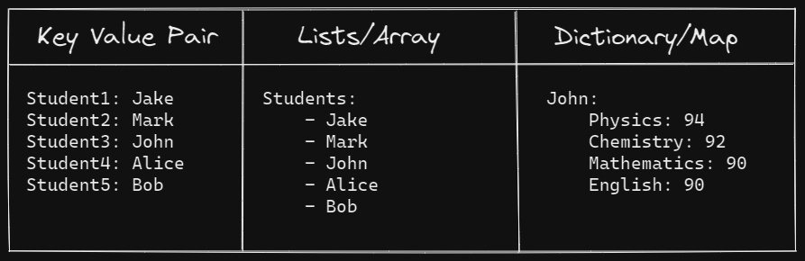

## Kubernetes YAML

- YAML is very strict about indentation. Everything in YAML is indentation based so make sure it's correct.
- Structure of YAML contains :
    1. Key Value Pair
    2. Lists/Array
    3. Dictionary/Map

- The picture below illustrates how to write all three with the students analogy. 



## YAML in Kubernetes
Creating a pod using a YAML based for configuration file.
Kubernetes uses YAML files as input for the creation of objects such as pods,deployments,replicas, services etc. The kubernetes resources are created in a declarative way.  
- All of these follow a similar structure :
    - All of theme contain these four top level fields 
  ```
  apiVersion:
  kind:
  metadata:


  spec:


  ```
Let's look at each one of them in detail -
  - apiVersion - this is the version of the k8s api you are  using to create the object. 
  - kind - it refers to the type of object we are trying to create (pod,deployment,replicaset,service)
  - metadata - It basically refers to data about the object like it's name, labels etc. The name is a string value and the label is a dictionary. 
    - ```
        metadata: 
            name: myapp-pod
            labels:
                app: myapp
                type: front-end
        ```
  - spec - this is where we will provide the image that will run inside the pod on a container. This is where we will provide additional information about the object which we going to create such as it's specifications. containers in this case is a list/array because a pod can have multiple containers. `-` indicates that this is the first element of the list. 
  - Selector is an optional object that tells kubenetes to only target pod that match the specified labels.
    - ```
        spec:
            containers:
                - name: nginx-container
                  image: nginx


