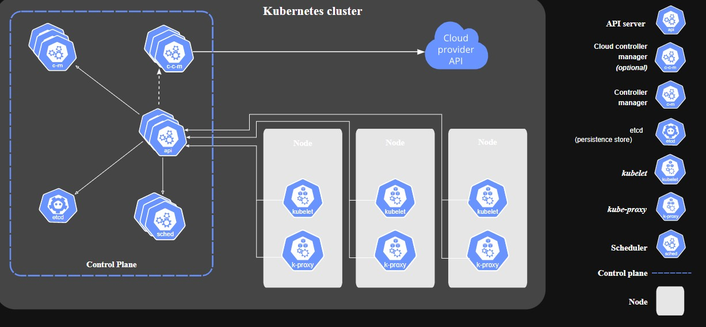

## Kubernetes Architecture

- If we will analyze kubernetes architecture then we will find that it is mainly divided into two components
  - Master Node (Also called control plane)
  - Worker Nodes 

### Control Plane 
- All the operations that run on the worker nodes are governed by control plane.
- A user interacts with control plane via three routes :
  - CLI
  - Web UI
  - API

- Components of Control Plane 
1.  *API server* 
- The API server intercepts RESTful calls from users, operators and external agents then validates and process them
- The API Server is the only master plane component to talk to the etcd data store, both to read from and to save Kubernetes cluster state information - acting as a middle interface for any other control plane agent inquiring about the cluster's state.

2. *Controller Manager* 
    - it keeps track of what's happening in the cluster like if there is something that needs to be repaired or something. It continuously compares the desired state (provided in configuration file) with the current state (obtained from ETCD data store via the API server)
3. *Scheduler* 
4. - role of scheduler is to assign new workload objects such as pods to nodes. It receives the requirementes from the API server about what needs to be configured.The scheduler makes decision based on the current state of the kubernetes cluster. It obtains the cluster information from ETCD datastore via the API server. 
5. *ETCD* - It holds the current status of the kubernetes cluster at any point of time.

- In production environment we have at least two master nodes running because it is the vital part of the kubernetes architecture and if this stops then the whole application will go down. So, at any point of time we should have a backup of our master node.

### Worker Node 
- It is that part of the cluster on which your containerized application is running. 
- A worker node has following components :
  - container runtime
  - kubelet
  - proxy
  - Addons for DNS, Dashboard user interface, cluster level monitoring and logging

1. *Container Runtime*
- The smallest unit that we can deploy in kubernetes is a pod and kubernetes don't interact directly with containers. Therefore we need a container runtime for our containerized application to run. Kubernetes support runtime like containerd, cri-o, rkt etc. 
2. *Kubelet*
- Kubelet acts like an agent and is used for communication between nodes and the API server.
- It also interacts with container runtime on the node to run the containerized microservices associated with the pod.
3. Kube-proxy
- It is the network agent which runs on each node responsible for dynamic updates and maintenance of all networking rules on the node.

4. Addons
- DNS - DNS server to assign DNS records to kubernetes objects and resources
- Dashboard - A web based interface for cluster management
- Monitoring - collects cluster level container metrics and saves them to a central data store
- Logging - collects cluster-level container logs and saves them to a central log store for analysis.

