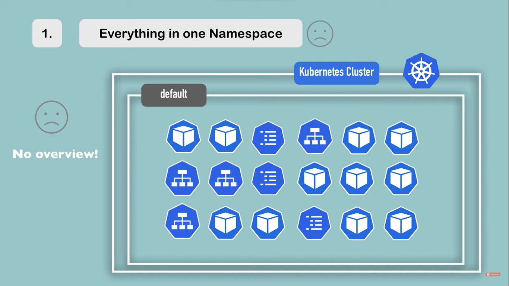
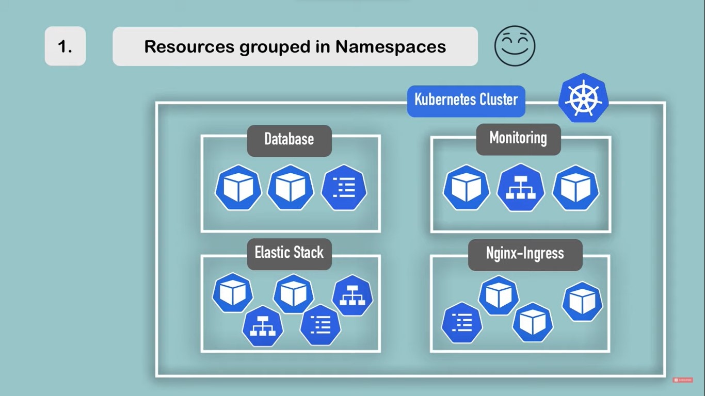

## Namespaces 101

- You can think of namespaces as a virtual cluster inside your kubernetes cluster
- In a production environment it is very easy for a team to accidently overwrite or disrupt another team without even realizing it.
- The ideal approach is to create multiple namespaces and segment them into sizeable chunks.
- Think of a school, In a big school we have different classrooms and different departments for different operations. Same here we can create different namespaces for different purposes. Say if we want to split our project into different teams then we can do that.
- Namespaces are a way to divide cluster resources between multiple users (via resource quota)
- When you start kubernetes it starts with 4 default namespaces
    - Default
    - kube-public
    - kube-system
    - kube-node-lease
- to view the namespaces use the command `kubectl get namespace`
## Why Namespaces?

Imagine you have your k8s cluster and you are deploying everything to the default namespace. After sometime it will become difficult to manage. 

- In the above image everything is in the default namespace. 

- In this case you should create a different namespace which looks something like this. 




## Creating a Namespace

- kubectl create namespace demo will create you a namespace with the name demo.
- You can also write a YAML file for creating a namespace.
- There are two ways to explicitly tell the kubernetes which namespace you want for your resources.
  - Using the --namespace flag
  - mentioning it in the yaml configuration
- We usually don't prefer writing in the yaml declaration because everytime the pod will be created in the same namespace. 


```
apiVersion: v1
kind: Namespace
metadata:
    name: demo
    labels:
        name: demo
```
- After creating this YAML file we can run `kubectl apply -f demo.yaml`
- to list all the namespaces run the command `kubectl get namespace`

```
apiVersion: v1
kind: Pod
metadata: mypod
labels:
    name: mypod
spec:
    containers:
        - name: mypod
          image: nginx
```
`kubectl apply -f mypod.yaml` this will create the resources in the default namespace. 
- To create your file in the demo namespace you need to apply it with the namespace flag `kubectl apply -f mypod.yaml --namespace=demo`


## Needs for namespaces

- When you are working on a kubernetes cluster with default namespace and you and your colleague have deployed a resource with same name then one will overwrite the other.
- When we need to split our team into sub teams for a project then we can create a different namespace for each of them.
  - Team Alpha
  - Team Beta
  - Team Gamma


## kubens
- When you run the kubens command, you should see all the namespaces with the active namespace highlighted. To switch you active namespace to your demo namespace simply run `kubens demo`

## Cross namespace communication 
- A service in one namespace can talk pretty easily to a service in another namespace 

## Credits
- [Techworld with Nana](https://youtu.be/K3jNo4z5Jx8)
- [Google cloud tech](https://youtu.be/xpnZX3if9Tc)