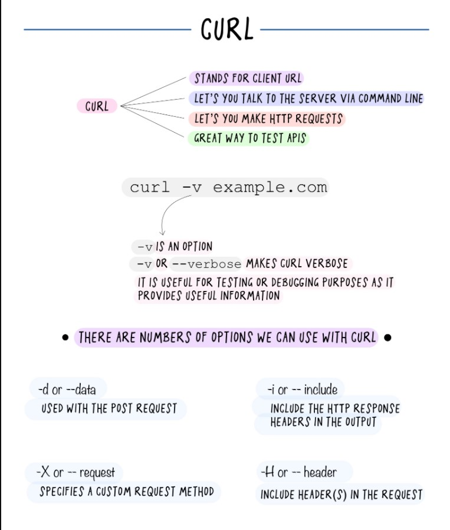

When two or more devices connect to each other via cables or wireless medium they form a network. Devices connected to a network have their own IP address which is essential for routing packets of information through the network. We need networking to share resources and communicate across the network with other users

Two types of IP addresses are there IPv4 and IPv6 

IPv4 - uses 32 bits and only 4.3 billion unique addresses

IPv6 - uses 128 bits and allows $3.8*10^8$ unique addresses

`ip -4 addr` will give you the IPv4 IP address

`ip -6 addr` will give you the IPv6 IP address

`netstat` will give you all the details about your network system

`netstat -at` will show you only tcp connections

`netstat -l` all the active ports 

`netstat -u` all the UDP connections

## Network Manager

- Check the network manager using NetworkManager 
- `systemctl status NetworkManager.service` (use capital N and M)
- nmcli connection show 
- We can check what process are running in background and waiting for requests using `ss` or `netstat` and these two utilities we can use. `ss` is modern and `netstat` is older and might get removed in the future versions of linux. 
- `sudo ss -ltunp` 
  - -l -> listening 
  - -t -> tcp connections 
  - -u -> udp connections
  - -n -> numeric values 
  - -p -> processes 
- remember it as `tunnel P` -tunlp 
- `systemctl disable <service>` will disable the service from auto starting at the boot time.   
- You can again enable it using the enable option. 
- You can stop using stop option and start it again using start command. 
- with tunlp we can also check the process ID associated with the service. 
- We can further explore about the service using the PID. `ps <pid>`
- *We can also check what files are opened by the process using the `sudo lsof -p <pid>` command.* 
- what is ttyd?
- I love the hostnamectl command useful in many aspects. 

## curl

`curl URL` will send a get request to the mentioned URL

`curl -X POST URL` will send a post request to the mentioned URL

A very good image explaining all the important CURL commands that one should know

