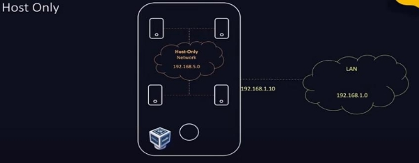
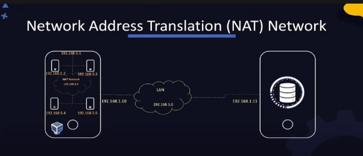
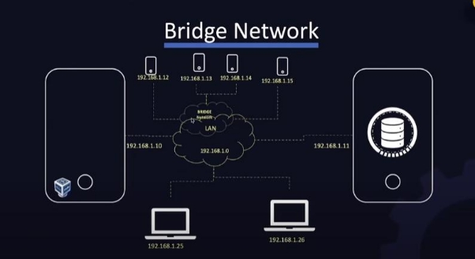
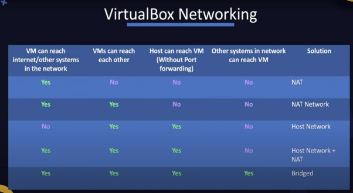

Shell Types:

- Bourne Shell (Sh Shell)
- C Shell (csh or tcsh)
- Z Shell (zsh)
- Bourne Again Shell (bash)

Find Out the Shell you are using:

- Echo $SHELL

Helps and print on the screen about environment variables.

Basic Commands:

- Echo (Print to Screen)
- Ls (list files & Folders)
- Cd (Change directory)
- Pwd (print present working directory)
- Mkdir (Make directory)
- “;” (using semicolon for multiple commands e.g. cd new\_directory; mkdir www; pwd.

Command Directories:

Make directory hierarchy /tmp/asia/pakistan/multan

- Mkdir /tmp/asia
- Mkdir /tmp/asia/pakistan
- Mkdir /tmp/asia/pakistan/multan

A better/single line way is;

- Mkdir -p /tmp/asia/pakistan/multan

Remove Directory;

- Rm -r /tmp/my\_dir1

Copy Directory;

- Cp -r my\_dir1 /tmp/my\_dir1

Command Files:

Create a new file (no content);

- Touch new\_file.txt

Add contents to file;

- Cat > new\_file.txt
- It will open up a new prompt in which you can add/type data in it for which in the end just press “CTRL+D” to save the content and exit the prompt.

View Content of file;

- Cat new\_file.txt

Copy file;

- Cp new\_file.txt copy\_file.txt (current file name & path | New path & file name)

Move(rename) file;

- Mv new\_file.txt sample\_file.txt

Remove(delete) file;

- Rm new\_file.txt

User Accounts:

Show user;

- whoami

Show User Id, groupid & groups;

- id

Switch User;

- Su “username” | than prompt will ask for password

When accessing one user from some other system using SSH;

- SSH “user\_name@ip\_address”

Normal user can’t use following command;

- Ls / root (permission denied error)

If permission is granted to that user or typing ‘sudo’ before it you can use that command with password;

- Sudo ls / root

Download Files:

Download a file method;

- Curl “file url link” -O

Download a file method and set its name to save it locally;

- Wget “file url link” -O “set file name | some-file.txt”

Check OS Version: Show list of OS;

- Ls /etc/\*release\*

Show Details of OS;

- Cat /etc/\*release\*

RPM (Red Hat Package Manager): Install package;

- Rpm -i telnet.rpm

Uninstall package;

- Rpm -e telnet.rpm

Query package;

- Rpm -q telnet.rpm

YUM (High level package manager | Also download other dependencies | Underhood use RPM | /etc/yum.repos.d):

Install package;

- Yum install ansible

Show install package and version;

- Yum list ansible

Remove Package;

- Yum remove ansible

Show Duplicates;

- Yum - -showduplicates list ansible

To Download Specific Version;

- Yum install ansible-2.4.4.0

YUM Repos:

Shows Set of Repositories;

- Yum repolist

Shows Where these repositories are configured;

- Ls /etc/yum.repos.d/

Show the URL of the location where all packages are stored;

- Cat /etc/yum.repos.d/CentOS-Base.repo

Services:

Start HTTPD Service;

- Service httpd start (use systemctl under the hood to start the service)
- Or
- Systemctl start httpd

Stop HTTPD Service;

- Systemctl stop httpd

Check HTTPD Service Status;

- Systemctl status httpd

Configure HTTPD to start at startup;

- Systemctl enable httpd

Configure HTTPD to not start at startup;

- Systemctl disable httpd

You want to run an app by using a service;

- /usr/bin/python3(service) /opt/code/my\_app.py(app)

To receive the response of the this app or web server we will use;

- Curl http:/localhost:5000

To make this whole thing into a service we will need to go /etc/systemd/system directory and create a file as a service e.g. my\_app.service and put following stuffs inside the file;

- [Service]
- ExecStart= /usr/bin/python3(service) /opt/code/my\_app.py(app)

To let systemd know that there is a new service we will use;

- Systemctl daemon-reload

VI Editor:

Working with Files: Open file with VI Editor;

- Vi index.html (it will open up the file which can be further distributed into 2 modes e.g.

\1. Command Mode & 2. Insert Mode. By Default we are using command mode.

Switch to Insert Mode;

- Press “i” (this will switch to insert mode | in this mode you can edit file)

Switch to Command Mode;

- Press “Esc” (in this mode you can issue commands like copy paste lines or navigates lines | you cannot modify the files)

VI Editor - Command Mode:

Move Around;

- Arrow keys or use “H, J, K, L”

Delete;

- Press “x” (delete a character)
- Press “dd’ (to delete a line)

Copy & Paste;

- Press “yy” (to copy a line)
- Press “p” (to paste a line)

Scroll Up/Down Page;

- Ctrl + U | Ctrl + D

Command;

- “:”

Save;

- “:w” | :w filenamme

Quit;

- “:q”

Save + Quit;

- “:wq”

Find;

- “/” e.g. /of (to select or move cursor to all similar “of” words press “n”)

VirtualBox:

Installation:

- Install VirtualBox for Windows
- Download CentOS from ‘osboxes.org’ (CentOS 7-1804 )
- Extract the files.
- Go to virtualbox and click on new
- Set ‘name’
- Set OS as Linux
- Set “other-64bit” if that option doesn’t show up you need to enable virtualization option from the bios
- After that select that OS image file that you have extracted.
- Set Ram to 2GB
- Then right click on the VM you have created and go to settings.
- Set CPU Cores to “2”.
- Set Network to “Bridge Connection”
- Save the configuration
- Right click and start the server

IP Configuration:

Show ip address;

- Ip addr show

Add IP Address;

- Ip addr add “192.168.1.10/24” dev(device) eth0(name of device)

To check whole internet configuration;

- Ifconfig (shows ip of the VM in 2nd line)

We can use external software like ‘putty’ or ‘mobaXtreme’ to connect these VM’s through SSH Connection.

In the previous setup we use the “bridge connection” from the network settings of the VM which will automatically get an IP by default assigned by the host machine’s router.

To have a manual IP address or have a specific port open to connect to the VM we will change the bridge connection to “NAT” from the network setting. Further we will click in advance in networks and forward the port by setting up a rule.

After that run your VM > turn on the terminal and check your ip address by “ip addr show”.

In the first line you will be able to see a loopback ip address. Copy it.

Now open your terminal in the host machine and type “ssh root(user you want to connect)@127.0.0.1(loopback ip address) -p(port flag) 2222(port we forwarded from the network setting of VM)”.

You will then be asked for the password of the user. After entering the password you will be connected to the terminal of that VM.

Host Only Network:

- All the VM’s are connected internally but they can’t reach the outside world from the virtual box. It is a private host-only network.
- To create it click on file in Virtualbox and select Host network manager > Click on create and it will create a Host Only Network inside the virtualbox and show a name and ip address assigned to it > go to VM’s network settings and select host-only adapter select the name of the host only network we created before.
- Can Enable the internet or to connect with external environments by enabling IP Forwarding.

Network Address Translation (NAT) Network:

- This will be able to connect or communicate with the outside world.
- From NAT Network, it will use NAT Engine which will convert it into host assigned IP address to communicate with the external environment and it will be the same for the receiving end.
- To create it go to virtualbox preference > network > then click on “+” button to create a new NatNetwork > once it is done go to network settings of VM and select the NAT Network > Select the name of the virtualbox’s NatNetwork.

Bridge Network:

- Act as extension of  the Host’s LAN Network.
- Get the same ip range of external LAN Network.
- Are part of the same LAN Network.

Virtual Box Networking:

Vagrant:

- Easy/Fast/Pre-build Solution for your VM on virtualbox
- Download Vagrant from vagrantup
- Install & restart
- Make an empty directory where you can download the VM Image.
- Google Vagrant Boxes which will take you to the vagrant cloud link.
- Click on CentOS 7
- It will show the commands to use to download it.
- Open Terminal and Type “vagrant init centos/7”
- This will create a new file names as “vagrantFile”
- Type Cat vagrantfile which will further show the configuration of the images which are commented out.
- Then later on type “vagrant up” which will start downloading the VM image for the virtualbox.
- If you open up your virtualbox application you will see that the VM is already running up and ready to connect by ssh.
- Type “vagrant ssh” to ssh and connect to the vagrant VM. for this you will not need any other third party software to connect to it.
- To shutdown type “vagrant halt”
- To check status of vagrant VM type “vagrant status”
- To do change settings of the vagrant vm image type “vi vagrantfile”
- Uncomment “config.vm.provider ‘virtualbox ’ do |vb|” so we can implement the settings to this vagrant vm image from this file only.
- For the memory of vm Uncomment / change the “vb.memory”
- For cpu core setting uncomment / change the “vb.cpus”
- For the name of vm uncomment / change the “vb.name”
- Whenever we make changes in the vagrantfile we need to type “vagrant reload” for the changes to take place.

List/Modify the host;

- Ip link

See routing table;

- Ip route | route

To add ip route;

- Ip route add 192.168.1.0/24 via 192.168.2.1

To check it ip forwarding is enable on the host;

- Cat /proc/sys/net/ipv4/ip\_forward
