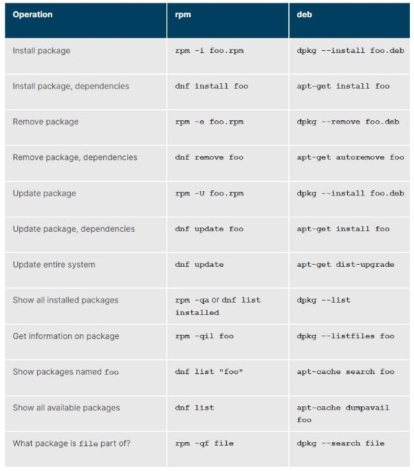
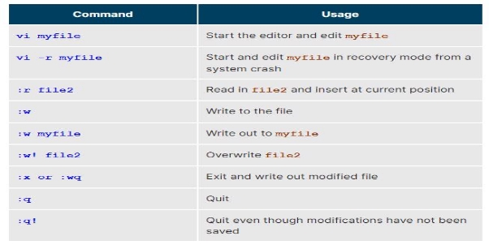
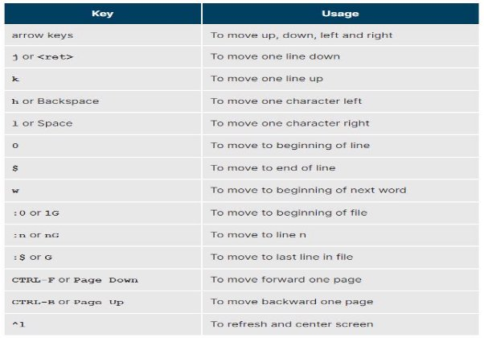
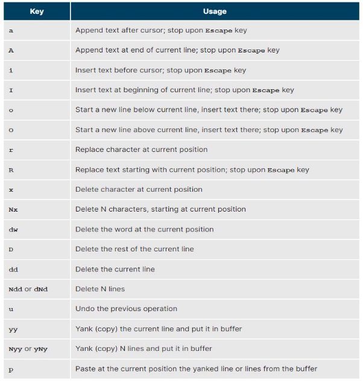
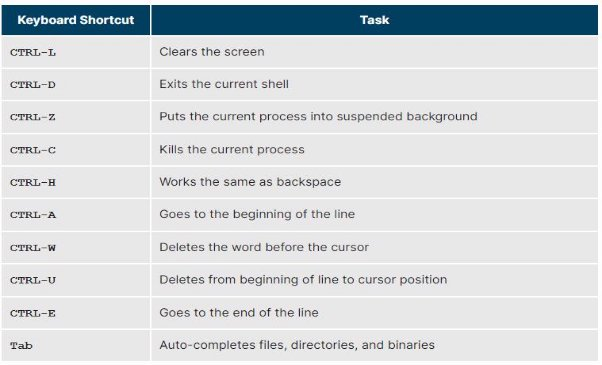
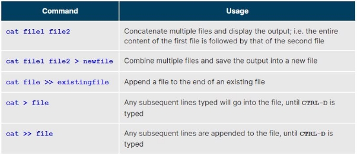
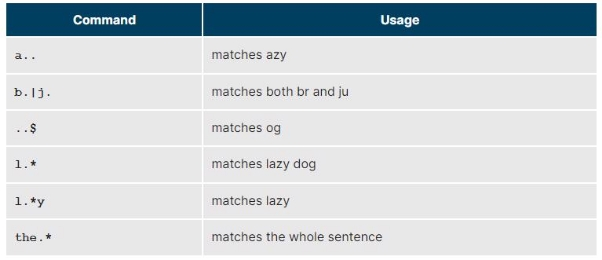

**CHOOSING A LINUX DISTRIBUTION:**

|SERVER|DESKTOP|EMBEDDED|
| - | - | - |
|RHEL / CentOS|Ubuntu|Yocto|
|Ubuntu Server|Fedora|Open Embedded|
|SLES|Linux Mint|Android|
|Debian|Debian||

|DISTRIBUTION FAMILIES|
| - |
|Red Hat|Debian|SUSE|
|Fedora|Debian|SUSE|
|RHEL|Ubuntu|openSUSE|
|CentOS|Linux Mint||
- Some system comes with some pre-installed advanced security system frameworks, such as SELinux or AppArmor e.g. all Red Hat-based systems including Fedora and CentOs always use SELinux by default, and ubuntu comes with AppArmor up and running.

INSTALLATION:

UBUNTU;

- Install VMware Workstation
- Inside VMware Workstation Player > Click on Create a New Virtual Machine > Select Ubuntu Image > Click on Next > File up the Personalise Linux Form like, Full Name, User Name, Password, Confirm Password
- After clicking on Next > Put your Virtual Machine Name and Location where you want to keep the files.
- Click Next > Choose Disk Space (Minimum 30GB) > You can select Virtual DIsk saved as one file or split into multiple files (choose single file)
- Click next > Click on Customization > Increase the memory to 4GB > Increase the Processors to 4
- Click on Finish
- Start the Install after a couple of messages on screen.
- It will take some time to install the Ubuntu on your VM
- After that it will pop up a screen showing to insert the password which you setup before the installation and with successful login it will forward you inside the Ubuntu.

CENTOS;

- After finishing the VM settings > it will open up a terminal looking black screen in which you have to choose between 1. Install CentOS Linux [version] 2. Test this Media and Install CentOS Linux [version]
- Choose the first option because 2nd option requires a lot of configuration and time consuming
- After installation it will ask for language
- It will further open up the installation summary e.g. Keyboard, language support, data
  - time etc
- For time & date it is actually better to enable the Network & Host Management
- By clicking on it > click further on turning on the network which will further show the network ips like host ip, machine ip, dns etc
- It is better to configure it so click further on configuration
- In ethernet section default choices are fine (device name will be ens160)
- Click on general > check if all user must connect to the network is selected > connect automatically with priority
- Click on ipv4 > which would automatically will be DHCP
- By doing all that will enable the networking timing inside the “time & date” section
- In that you can further select your region and city etc
- For software selection, select the workstation option > further you can select the softwares you need for basic setup
- Further you can select the partition > in that select the standard partition > further click on the “+” button which will ask for allocation of the space you just need to select the mount point as “/” and desired capacity to 29gb
- Further add “+” button again and this time mount point will be “swap” and leave the desired capacity section empty
- It will further show one gigabytes is still available
- Click on the first mount point for which the partition type by default will be “xfx” which we will change it into ext4 which is easier to mount from other machines | also we can use the default
- After all that it will ask for confirmation and will show you the details of the configuration and you need to confirm it
- Further there will be a KDUMP section which is a software responsible for storing the crashes report of the system. Usually we don’t need that so we will disable it and will increase the performance / bootup timing.
- No need to configure security policy > just leave it empty and proceed to further installation steps.
- By clicking on the begin installation > it will show you option of root account > click on it > set your root account password inside it > click on done
- Now create a New user by clicking on create user > fill up the options like fullname, user name, password & confirm password > do not the the first option “make this user administrator”
- It is better to have separate normal users and root users > click on done
- Select the default kernel
- Accept the licensing which is pretty much common for open-source projects.
- After a few CLI options it will show you the login option.
- It will further ask for online accounts, keyboard and turn on location settings.

OPEN SUSE;

- After finishing the settings on VMware workstation > it will turn on the GUI of SUSE > click on installation > show some terminal commands > shows typical GNOME graphical screen.
- Select the language > accept the agreement with next > install further softwares and things > you can than select suggested partitioning > click on edit settings > select the Partition based proposal on the new opened mini screen > select file system as Ext64 > unselect the separate home partition > click “okay”
- It will further show the mounted section as 2gb and 28gb sections
- After that you can pick the timezone
- It will further ask for user interface and we will select GNOME
- After that it will ask for local user information like full name, username, password, confirm > unselect the “use this password for system administration” & “auto login” > click on next
- Now it will ask for root password and random words in keyboard layout
- It will further install the other packages of the SUSE
- Select open new SUSE system
- So first time update the system

PACKAGE MANAGER IN DIFFERENT DISTRIBUTIONS:

TYPES OF PROCESS:

TYPES OF USER AND GROUP IDS:

USER STARTUP FILES:

- /etc

LINUX TEXT EDITORS:

- Nano, gedit | Basic editors
- Vi, emacs | Advanced editors

WHAT IS eth0 / eth01:

- This could be your main wired connection's default name in the system saved already.
- Automatically it is going to DHCP

OPEN GNOME TWEAK TOOL:

- Alt + F2

DEFAULT DISPLAY MANAGER FOR GNOME:

- Gdm

TO PERMA DELETE A FILE:

- Shift + Delete

DEFAULT TEXT EDITOR:

- gedit

DEFAULT FILE MANAGER:

- Nautilus

TO SET UP APPLICATIONS AS DEFAULT:

- Go to setting sections > click on default application or details > default application

SHORT KEYS:

- Using the graphical user interface press ‘windows + L or windows + escape’ key to open the section for logging out
- Press “Ctrl + H” to show hidden files.
- To Search “Ctrl + F”

CONTAINS EXECUTABLE BINARIES:

- /bin

CONTAINS BINARIES RELATED TO SYSTEM ADMINISTRATION:

- /bin /sbin

COMMANDS THAT ARE NOT ESSENTIAL FOR THE SYSTEM:

- /usr/bin  |   /usr/sbin

VAR DIRECTORY:

- /var/log: system log files
- /var/lib: packages and databases files
- /var/spool: print queues
- /var/tmp: temporary files

COMMANDS:

To check disk free space;

- Df -Th
- Flag -T show what type of file system we have
- Flag -h show/print the result in megabytes and gigabytes

To Check Swap Files;

- Cat /proc/swaps

To open file manager from terminal:

- Type nautilus

To Ascertain your current Resolution by Command:

- username:/tmp> $ xdpyinfo | grep dim

To type out the content of a file:

- Cat file\_name.txt

To see first few lines of a file:

- Head file\_name.txt
- Use -n flag to mention the no. of lines you wanna see

To see last few lines of a file:

- Tail file\_name.txt
- Use -n flag to mention the no. of lines you wanna see

To see documentation of a command:

- Man command\_name

To have one program take as input the output of another (pipe symbol “|”) :

- Man head | grep OPTION

To Switch to Superuser:

- Type “su”
- Further it will ask for password > input the password
- You will a different looking prompt often ending with “#”

To create a configuration file to enable a user account to use sudo:

- Location = /etc/sudoers.d/username
- echo "username ALL=(ALL) ALL" > /etc/sudoers.d/username
- In some linux distribution you will still face if you do not change permission on the file by doing;
- Chmod 440 /etc/sudoers.d/username

To turn off the graphical desktop:

- Sudo systemctl stop gdm | sudo telinit 3
- To restart it after logging into the console;
- Sudo systemctl start gdm | sudo telinit 5 | before 18.04 LTS substitute was lightgdm for gdm

To Connect into a remote system by using SSH(Secure Shell):

- Ssh username@ip\_address|remote-server.com

To Reboot or Shutdown a System:

- Poweroff
- Shutdown -h(halt) +5 | this is will shutdown the system in next 5min
- Reboot
- Shutdown -r(reboot)
- When administering a multi-user system, you have the option of notifying all users prior to shutdown, as in:
- sudo shutdown -h 10:00 "Shutting down for scheduled maintenance."
- For reboot and shutdown you need root user access

To find out the exact location of a program:

- Which program\_name | output example: /usr/bin/program\_name

To look for package in a border range of system directories:

- Whereis program\_name | output example: /usr/bin/diff /usr/share/man/man1/diff.1.gz
- Locating source and man files packaged with the program

To Display current working directory:

- Pwd

To change directory:

- Cd directory\_name

Change directly to home directory:

- Cd | cd /

To Change parent directory:

- Cd ..

Change to previous directory:

- Cd -

Save the current directory into a stack and move to a new directory:

- Pushd directory\_name
- Prints current directory and history of previous folder from which you jump in

Bring you back to previous directory:

- Popd

To see history created by pushd command:

- dirs

Absolute pathname method:

- Cd /usr/bin

Relative pathname method:

- Cd ../../usr/bin

To list directories:

- Ls
- Ls -a (will list files including hidden files/directories)

To have a tree view of the filesystem:

- Tree
- Tree -d ( to view just the directories and to suppress listing file names)

To create a link between two files:

- Ln target\_file\_name destination\_file\_name
- For soft link use -s flag

To view content of files:

- Cat file\_name
- -n with this flag you can see line numbers a file have

To look file’s content in backward:

- Tac file\_name

To view a larger files content where you can scroll and navigate easily:

- Less file\_name
- -N gives line numbers with content of a file

To see the number of lines/word count of a file:

- Wc file\_name

To create an empty file:

- Touch file\_name
- To add timestamp and date;
- Touch -t 12091600 file\_name | 12(month)09(day)1600(year)

To make a directory:

- Mkdir directory\_name
- Mkdir -p directory\_name/directory\_name/directory\_name | make directory inside directory

To remove a directory:

- Rmdir directory\_name
- To remove a directory and all of its content | Forcefully remove a directory recursively;
- Rm -rf directory\_name

To rename a file:

- Mv file\_name new\_file\_name | same can be done for directory
- To move a file from one directory to another;
- Mv file\_name directory

To remove a file:

- Rm
- Rm -f | forcefully remove a file
- Rm -i | interactively remove a file by prompt options

To execute multiple commands:

- Command 1 | command 2 | command 3
- “|” this is pipe symbol

To find a file:

- Locate file\_name
- Find . -name “file\_name” -ls | dot is used for current directory, -name for file\_name, -ls is used to list the files along with further details | can also mention d flag for just directory searches | can also mention f for regular files searches
- Some wildcard/flags
- ? Matches any single character | can used inplace of unknown words/characters | ls ba?.out
- \* Matches any string of characters | ls \*.out (to list a file having .out extension)
- [set] Matches any character in the set of characters, for example [adf] will match any occurrence of a, d, or f
- [!set] Matches any character not in the set of characters

To view load average we can use:

- W
- Top
- Uptime

To kill a process:

- Kill

To terminate a foreground job:

- Ctrl + z or Ctrl + c

To run a process in the background:

- Bg
- Fg

To check the jobs or process running on background started by user:

- Jobs
- Jobs -i
- If you log off, the jobs utility not shows the ones started from that window

To see process with more information:

- Ps -f will show further parents process id
- Ps -u to see process with user specified order
- Ps -ef will show further information
- Ps -esl show complete one line information
- Ps aux will displays all processes of all users with cpu and memory usage
- Ps axo allows you to further specify which attributes u want to see e.g. ps axo stat, priority, pid, pcpu, comm | head -10
- Pstree to see processes in a tree format

Different tags shows up when getting information about process:

- PID process identification number
- USER process owner
- PR priority NI nice values
- VIRT virtual RES Physical SHR shared memory
- S status
- %CPU %MEM cpu and memory
- TIME+ execution time
- COMMAND command

To see top process running on the system:

- Top
- Press H to see further details or help to check process

To find a file with time:

- Find / -ctime 3 (file ownership, permissions, etc.)

To find file based on sizes:

- Find / -size 0
- Find / -size +10M -exec command {} ‘ ;’

To get information about a command/ package:

- Man command/package\_name
- Info command/package\_name
- --help flag option is useful as a quick reference

To see process on the system:

- Ps

To increase or decrease priority of a process:

- Ps lf
- Renice +5 process PID/PPID | if it gives error for permission use sudo
- High the value +20 lower the priority and lower the value -20 higher the priority gonna be.

To check difference between two files:

- Diff file\_name file\_name

To determine or check file type:

- File file\_name

To compress files by using gzip:

- Gzip \* | compress all files in current directory
- Gzip –r projectX | compress all files in the projectX directory
- Gunzip foo | use to unzip or de-compress foo.gz

To compress files by bzip2:

- Bzip2 \* | compress all of the files in current directory
- Bunzip2 \* .bz2 | decompress all of the files with extension of .bz2
- Also we can bzip2 -d to decompress

To disk to disk copying:

- Dd if=/dev/sda of=/dev/sbd
- Copy first dist device and created on the second disk device
- Will delete everything which previously exited on 2nd disk

To add a line in a file:

- Echo line one > myfile | single “”>” will send output of a command to a file
- Echo line two >> myfile | double “>>” will append the new output to the file
- Echo line three >> myfile

Same can be done by cat command:

- Cat << EOF > myfile
- >line one
- >line two
- >line three
- >EOF

To use nano editor:

- Nano file\_name
- CTRL + G | display help screen
- CTRL + O | write a file
- CTRL + X | exit a file
- CTRL + R | insert contents from another file to current buffer
- CTRL + C | show cursor position

To use gedit editor:

- Gedit file\_name  | open a GUI editor

To open a comprehensive tutorial for vi editor:

- Vimtutor

Basic commands of vi editor:

- Press “i” to enable insert mode
- Press “escape” to enable command mode
- Press “:” to switch to line mode from the command mode

To identify current user:

- Whoami

To list currently logged-on users:

- Who
- Who -a | option will give more detailed information

To add a user:

- Sudo useradd user\_name

To delete a user:

- Sudo userdel user\_name
- To remove the home directory while removing the account one needs to use the -r option to userdel.

To assign a custom command or alias to use on shell:

- Alias alias\_name=”cd /home/staff”
- Alias\_name | this will cd into staff directory

To see the history of the commands:

- History

Too execute previous command:

- !!

To reverse intelligent search:

- CTRL + R

To set permission of a file:

- Chmod 755 somefile
- 4 if read permission is desired
- 2 if write permission is desired
- 1 if execute permission is desired
- 7 means read/write/execute, 6 means read/write, and 5 means read/execute.
- In chmod 755, 7 is for user, 5 is for group and last 5 is for others
- To see complete information of a file type ls -l file\_name

To set ownership of a file:

- Sudo chown user\_name | root file\_name
- Sudo chown root:root file? | this will set root ownership of files whose names starts with file

To read or print the lines of a file:

- Cat file\_name
- 

To create and write inside a new file:

- Cat > file\_name

To view a compress file:

- Zcat compressed-file.txt.gz

To page through a compress file:

- Zless compress\_file\_name
- Zmore compress\_file\_name

To search inside a compress file:

- Zgrep -i less somefile.gz

To compare two compressed files:

- Zdiff file1.txt.gz file2.txt.gz

To count duplicate entries count:

- Uniq -c filename

To remove duplicate entries from multiple files at once:

- Sort file1 file2 | uniq > file3
- Or sort -u file1 file2 > file3

To paste contents of two files into one:

- Paste file1 file2

To use delimiter in paste command:

- Paste -d ‘:’ file1 file2
- Common delimiter are ‘space’ ‘tab’ ‘|’ ‘comma’ etc

To split a file into equally sized files:

- Split file\_name\_to\_be\_split new\_files\_name

To count words in a file:

- Wc -l | number of lines
- -c flag will display the number of bytes
- -w flag will display the number of words

To search inside the content of files:

- Grep keyword location
- Can also use regular expressions -
