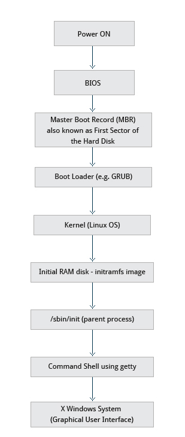

# The Booting Process

## Bird eye view

## The Steps

### 1. BIOS (Basic Input/Output System) - The First Step:
- Its job is to Initialize the hardware and test the main memory.
- This process is also known as POST (Power On Self Test).
- Once the POST is complete, control passed on to the boot loader.

 

### 2. MBR(Master Boot Record) and Boot Loader:
- MBR and GPT (GUID Partition Table) are partitioning schemes.
- BIOS based systems use MBR whereas UEFI (Unified Extensible Firmware Interface) based systems use GPT.
- GPT supports partitioning of drives greater than 2 Terabytes (a limitation in legacy systems.)
- The boot loader is stored generally in the boot sector (BIOS/MBR) or the EFI partition (UEFI/GPT).
- The boot loader is responsible for loading the kernel image and the initial RAM disk or filesystem into memory.
- Some linux bootloaders : 
    - GRUB (GRand Unified Boot loader)
    - ISOLINUX
    - DAS U-Boot
    
 

### 3. Boot loader in action:
MBR
- The boot sector is generally the first sector of the hard disk, also known as the MBR (512 bytes in size.)
- Boot loader examines the partition table and finds a bootable partition.
- It then searches for the second stage boot loader (ex: GRUB), and loads it into memory.

UEFI
- UEFI firmware reads its Boot Manager data to determine which UEFI application is to be launched and from where (i.e from which disk and partition the EFI partition can be found).
- Then it launches the UEFI application, for example GRUB, as defined in the boot entry.

The boot loader loads the kernel into memory and passes control to it.

**NOTE** : 
- The second stage bootloader resides under **/boot**
- the kernel and initramfs are loaded into memory.
- Kernels are almost always compressed. So, the first job is to decompress them after which system hardware is checked and analyzed by the kernel and any device drivers built into the kernel are initialized.

 

### 4. Initial RAM Disk (initramfs):
- initramfs filesystem image mounts root filesystem.
- provides kernel functionality for the needed filesystem.
- provides device drivers for mass storage controllers with udev facility.
- udev locates device drivers and loads them.
- root filesystem is now checked and mounted.
- mount program instructs the OS about the filesystem ready for use and associates it with a particular point in the overall hierarchy of the filesystem (the mount point).
- after successful mounting, initramfs is cleared from memory and the init program is executed on the root filesystem (/sbin/init) by the kernel.

init:
- handles the mounting and pivoting over to the final real root filesystem.
- it becomes the initial process with a PID of 0 and manages non-kernel processes.
- besides starting the system, init is responsible for keeping the system running and for shutting it down cleanly.
- systemd is an example of init system.