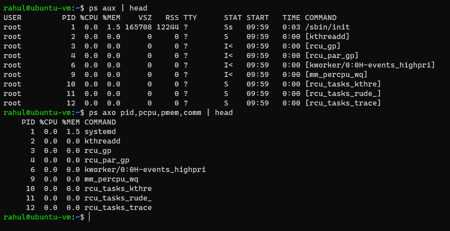

## Format
`command [--options/-o]`

## Some Commands

- `cd-`     : remembers where you were last, and lets you get back there
- `less`    : view larger files with scroll-back capability
- `whereis` : locates source and `man` files along with binaries
- `which`   : shows the location of installed package
- `locate`  : performs a database search to find all file names that match a given pattern
- `find`    : locates files recursively from a given directory or set of directories
    - `-type` option specifies the search type. d (directory) or f (regular files)
    - `-exec` option can run command on files found
- `ln`      : creates hard links
    - `-s`    option creates soft/symbolic/sym links
- `man`     : command to view manual pages
    - `-k`    option searches for a specific topic
    - `-f`    option lists all the pages on the topic
    - `-a`    opens all the pages on the topic one by one
- `ps`      : lists the currently running processes keyed by [PIDs](./process.md)
    - `lf`    option lists extra info along with priority
    - `-u`    option lists all processes for a specified username
    - `-ef`   option lists all the processes in the system
    - `-eLf`  option displays one line of info for every thread
- `pstree`  : displays processes in a tree format. threads are in `{}`
- `top`     : displays realtime update of processes
- `kill`    : sends a specified signal to the specified processes or process groups
    - format: `kill [-signal number] [pid]`
    - ex    : `kill -9 1198`
- `renice`  : changes the niceness (priority) of a process
    - format: `renice [nice value] [pid]`
    - ex    : `renice +5 1198`
- `bg`      : run a process in background
- `fg`      : run a process in foreground
- `jobs`    : displays all jobs running in background
    - `-l`     option adds a PID to the displayed list
- `at`      : execute any non-interactive command at a specified time
- `sleep`   : suspends execution of command or job for a specified period of time
    - syntax: `sleep NUMBER[SUFFIX]`
    - suffix:
        - `s` for seconds
        - `m` for minutes
        - `h` for hours
        - `d` for days

**NOTE**:
- The pipe symbol ( | ) is used to input the output of the first command into the second command.
- Hard links have the same [inode number](https://en.wikipedia.org/wiki/Inode) and can work even if the linked file is removed.
- Soft links have  different inode numbers and clearly point to the parent file like a shortcut.
    - they can point to objects even on different filesystems, partitions and/or disks
    - the pointed objects may not even exist
- If no signal is specified in the kill command, the TERM signal is sent.
    - TERM terminates the process after the target program has finished cleaning up.
    - KILL (number 9) signal doesn't give the target program the aformentioned oppertunity.
- A suffix of `&` to a command instructs it to execute in the background freeing the shell to the user. Ex : `sudo apt-get update &`
- The background jobs are connected to the terminal window, so, if you log off, the jobs utility will not show the ones started from that window.
- `ps` also has BSD styled option specification (without using `-`)
    - `ps aux` lists all processes of all users
    - `ps axo` allows specifying wanted attributes
    - 

