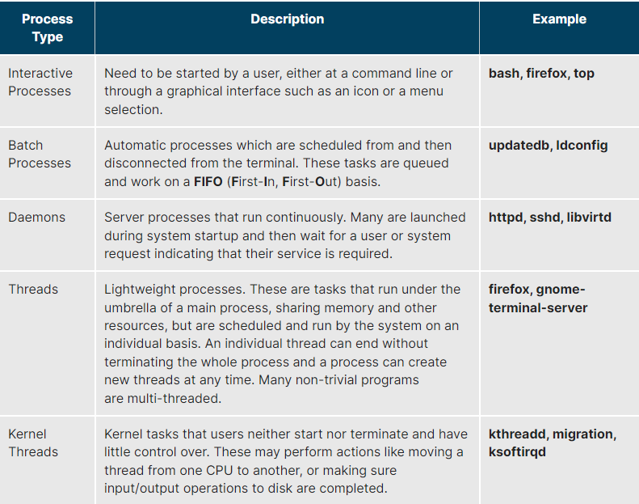
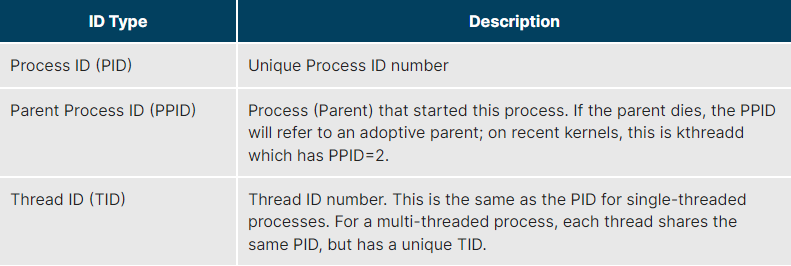
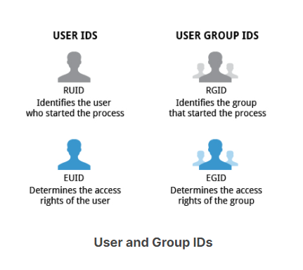
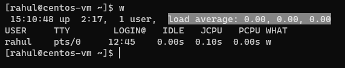
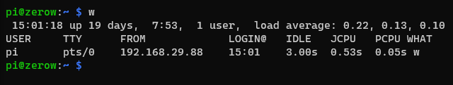
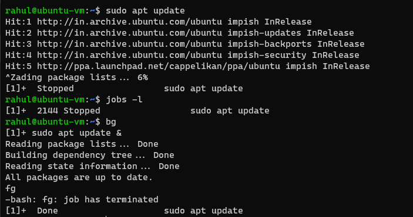
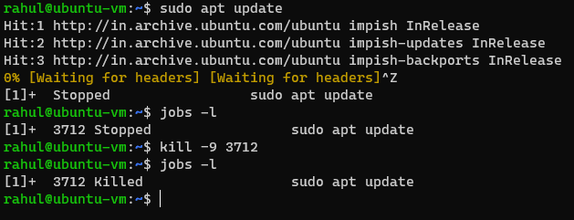
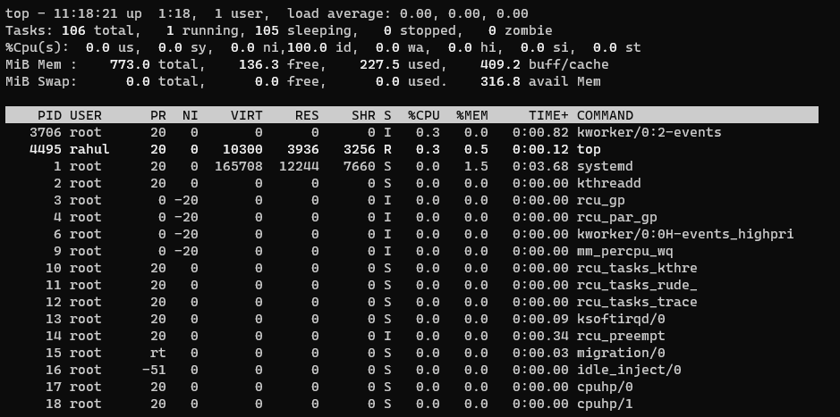
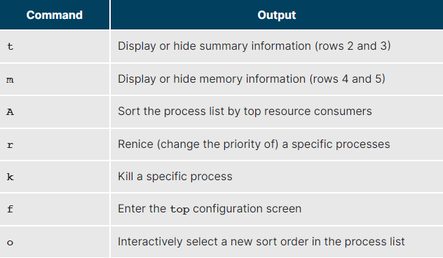
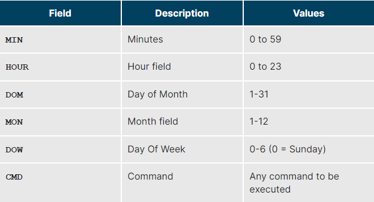

# What Is a Process?
An instance of one or more related tasks (threads) executing on your computer.

## Types of processes

 

## Process Scheduling
- **Scheduler** : A critical kernel function which constantly shifts processes on and off the CPU, sharing time according to relative priority, how much time is needed and how much has already been granted to a task.

 

## Process States
- **Running** state : process is either currently executing instructions on a CPU, or is waiting to be granted a share of time (a time slice) so it can execute.
All processes in this state reside on what is called a run queue and on a computer with multiple CPUs, or cores, there is a run queue on each.

- **Sleep** state : processes are waiting for something to happen before they can resume. 
In this condition, a process is said to be sitting on a wait queue.

- **Zombie** state : a child process that is complete but the parent process has not asked about its state. It's not really alive, but still shows up in system's list of processes.

 

## Process and Thread IDs
The OS keeps track of processes by assigning each a unique process ID (PID) number.
**PID** is used to track:
- process state
- CPU usage
- memory use
- precise resource location in memory

PIDs are assigned in ascending order. Thus, PID 1 denotes the **init** process (initialization process), and succeeding processes are gradually assigned higher numbers.

 

## User and Group IDs
- The OS identifies the user who starts the process by the Real User ID (RUID) assigned to the user.
- The user who determines the access rights for the users is identified by the Effective UID (EUID). The EUID may or may not be the same as the RUID.
- Users can be categorized into various groups. Each group is identified by the Real Group ID (RGID).
- The access rights of the group are determined by the Effective Group ID (EGID). Each user can be a member of one or more groups.

 

## Priorities
- Priority for a process can be set by specifying a nice value.
- A process with a higher nice value allows a process with a lower nice value to the executed first. (like an adult and a child)
- A **real-time priority** can be added to time-sensitive tasks.This is just a very high priority and is not to be confused with what is called hard real-time which is conceptually different, and has more to do with making sure a job gets completed within a very well-defined time window.

 

## Load average
Average of the load number for a given period of time. It takes into account processes that are:
- Actively running on a CPU.
- Considered runnable, but waiting for a CPU to become available.
- Sleeping: i.e. waiting for some kind of resource (typically, I/O) to become available.

Can be viewed by running `w`, `top` or `uptime`.

### Interpreting Load Averages

The above screenshot is of a raspberry pi zero w (single core)

- Load average is displayed using three numbers (**0.22**, **0.13**, **0.10**)
- It can be interpreted as : 
    - 0.22: For the last minute the system has been 22% utilized on average.
    - 0.13: For the last 5 minutes utilization has been 13%.
    - 0.12: For the last 15 minutes utilization has been 12%.
- A value of **1.00** means 100% utilization whereas a value over **1.00** implies the system was over-utilized : there were more processes needing CPU than CPU was available
- In a CPU with more than one cores, say a quad-CPU system, we would divide the load average by the number of cores. 
    - Ex : With a load average of **4.00**, we would get a 100% utilization (4.00/4) in a quad-CPU system.

 

## Some background and foreground job operations

Example : 1

- Step 1 : start a job (`sudo apt update`)
- Step 2 : suspend it (Ctrl + Z)
- Step 3 : list all jobs with PID (`jobs -l`)
- Step 4 : start the most recent job in background thereby freeing the shell (`bg`)
- Step 5 : put the process in foreground again (`fg`).

The shell is freed after completion.

 

Example : 2

- Step 1 : start a job (`sudo apt update`)
- Step 2 : suspend it (Ctrl + Z)
- Step 3 : list all jobs with PID (`jobs -l`)
- Step 4 : kill it with signal number 9 (`kill -9 3712`)

 

## top

- Line 1
    - up : uptime
    - user : number of users
    - load average

- Line 2
    - Tasks
        - running
        - sleeping
        - stopped
        - zombie

- Line 3
    - CPU time divided between
        - us : user
        - sy : kernel
    - ni : % of user jobs running at a lower priority (niceness)
    - id : % of jobs that are idle. lower at higher average loads and vice-versa.
    - wa : % of jobs waiting for I/O
    - hi : hardware interrupts
    - si : software interrupts
    - st : steal time used with VMs, which has some of its idle CPU time taken for other uses

- Lines 4 and 5
    - indicate memory and swap usage

### Process list of the top output
Each line displays info about a process ordered by highest CPU usage. The following info is displayed:
- Process Identification Number (PID)
- Process owner (USER)
- Priority (PR) and nice values (NI)
- Virtual (VIRT), physical (RES), and shared memory (SHR)
- Status (S)
- Percentage of CPU (%CPU) and memory (%MEM) used
- Execution time (TIME+)
- Command (COMMAND).

### Commands in top

 

## cron

- time based scheduling utility program.
- uses a config file called /etc/crontab (cron table)
- crontabs can be system wide and individual user-based.
- each line represents a job and is composed of a CRON expression, followed by a shell command to execute.
- `crontab -e` opens the crontab editor.
- each line of the crontab file will contain 6 fields.

Examples:

- The entry `* * * * * /usr/local/bin/execute/this/script.sh` will schedule a job to execute script.sh every minute of every hour of every day of the month, and every month and every day in the week.
- The entry `30 08 10 06 * /home/sysadmin/full-backup` will schedule a full-backup at 8.30 a.m., 10-June, irrespective of the day of the week.