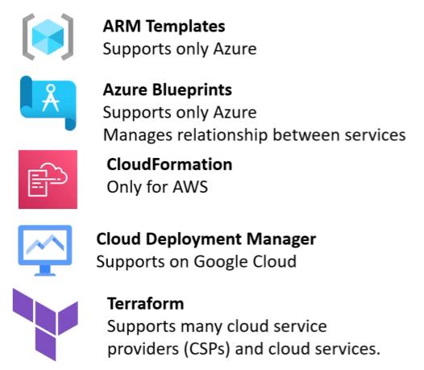
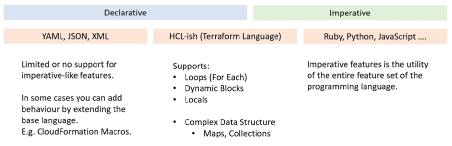

# HashiCorp Terraform

## What is Terraform Associate?
The HashiCorp Terraform Associate is speciality certification in Terraform; an Infrastructure as Code (IaC) tool that is Declarative and Cloud Agnostic

# IaC Concepts

## What is Infrastructure as Code?
The Problem with Manual Configuration
Manually configuring your cloud infrastructure allows you easily start using new service offerings to quickly prototype architectures however it comes with many downsides:
- Its easy to mis-configure a service though human error
- Its hard to manage the expected state of configuration for compliance
- Its hard to transfer configuration knowledge to other team members

## Infrastructure as Code(IaC)
You write a configuration script to automate creating, updating or destroying cloud infrastructure.
- IaC is a blueprint of your infrastructure
- IaC allows you to easily share, version or inventory your cloud infrastructure.

## Popular Infrastructure as Code tools (IaC)
### Declarative
- What you see is what you get. Explicit
- More verbose, but zero chance of mis-configuration
- Uses scripting languages eg. JSON, YAML, XML

### Imperative
- You say what you want, and then rest is filled in. Implicit
- Less verbose, you could end up with misconfiguration
- Does more than Declarative
- Uses programming languages eg. Python, Ruby, JavaScript

## Declarative+
Terraform is declarative but the Terraform Language features imperative-like functionality.

