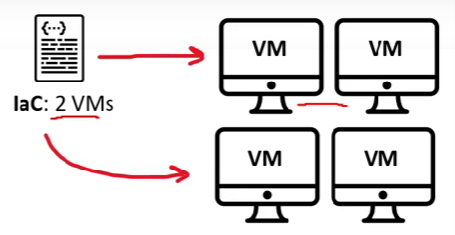
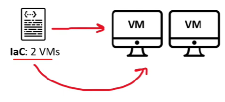

## Infrastructure Lifecycle
### What is Infrastructure Lifecycle?
A number of clearly defined and distinct work phases which are used by DevOps Engineers to plan, design, build, test, deliver, maintain and retire cloud infrastructure.

### What is Day 0, Day 1 and Day 2?
Day 0-2 is a simplified way to describe phases of an infrastructure lifecycle
-	Day 0 – Plan and Design
-	Day 1 – Develop and Iterate
-	Day 2 – Go live and maintain

*Days do not literally mean a 24 hour days and is just a broad way of defining where a Infrastructure project would be*

## Infrastructure Lifecycle
How does IaC enhance the Infrastructure Lifecycle?
### Reliability
IaC makes changes idempotent, consistent, repeatable, and predictable.

Idempotent: No matter how many times you run IaC, you will always end up with the same state that is expected

### Manageability
- Enable mutation via code
- Revised, with minimal changes

### Sensibility
Avoid financial and reputational losses to even loss of life when considering government and military dependencies on infrastructure.
## Non-Idempotent vs Idempotent
| Non-Idempotent | Idempotent |
| -------------- | ---------- |
| When I deploy my IaC config file it will provision and launch 2 virtual machines | When I deploy my IaC config file it will provision and launch 2 virtual machines |
| When I update my IaC and deploy again, I will end up with 2 new VMs with a total of 4 VMs | When I update my IaC and deploy again, it will update the VMs if changed by modifyinh or deleting and creating new VMs |
| We expect a state of 2  
We end up with 4 | We expect a state of 2  
We end up with 2 |
|  |  |

## Provisioning vs Deployment vs Orchestration
### Provisioning
To prepare a server with systems, data and software, and make it ready for network operation. Using Configuration Management tools like Puppet, Ansible, Chef, Bash scripts, PowerShell or Cloud-Init you can provision a server

When you launch a cloud service and configure it you are “provisioning”

### Deployment
Deployment is the act of delivering a version of your application to run a provisioned server
Deployment could be performed via AWS CodePipline, Harness, Jenkins, Github Actions, CircleCI

### Orchestration
Orchestration is the act of coordinating multiple systems or services.
Orchestration is a common tram when working with microservices, Containers, and Kubernetes.
Orchestration could be Kubernetes, Salt, Fabric
