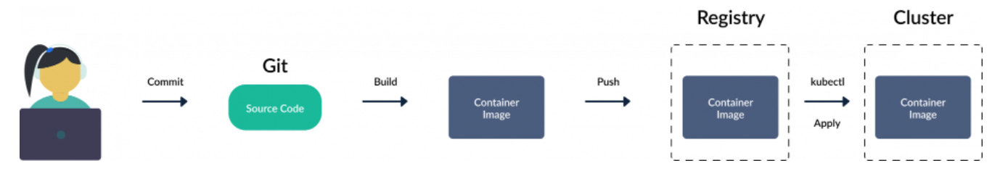
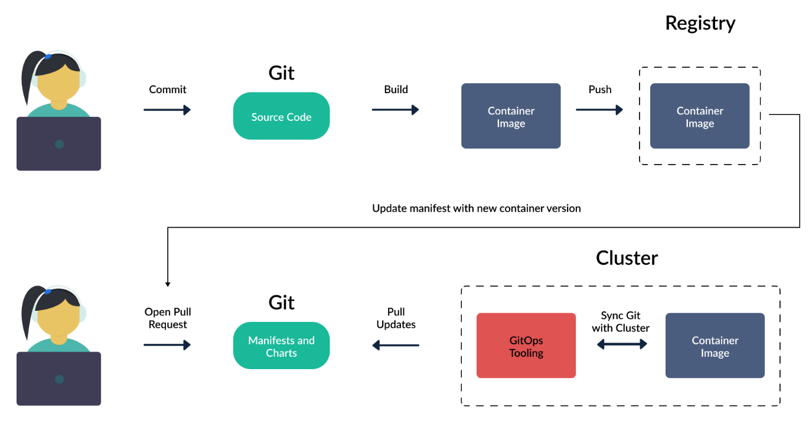

# GitOps

## What is GitOps ?
GitOps is a set of best practices where the entire code delivery process is controlled via Git, including infrastructure and application definition as code and automation to complete updates and rollbacks.

## Key Principles of Git
- The entire system (infrastructure and applications) is described declaratively.
- The canonical desired system state is versioned in Git.
- Changes approved are automated and applied to the system.
- Software agents ensure correctness and alert on divergence.

### In the case of Kubernetes, GitOps deployments happen in the following manner:

- A GitOps agent is deployed on the cluster.
- The GitOps agent is monitoring one or more Git repositories that define applications and contain Kubernetes manifests (or Helm charts or Kustomize files).
- Once a Git commit happens the GitOps agent is instructing the cluster to reach the same state as what is described in Git.
- Developers, operators. and other stakeholders perform all changes via Git operations and never directly touch the cluster (or perform manual kubectl commands).

**Important Points:**  
- The cluster state is manually decided by kubectl commands or other API access.
- The platform that deploys to the cluster is having full access to the Kubernetes cluster from an external point.

### With GitOps, we can modify the process as below:

- The first steps are the same. A developer commits source code for the application and the CI system creates a container image that is pushed to a registry.

- Nobody has direct access to the Kubernetes cluster. There is a second Git repository that has all manifests that define the application.

- Another human or an automated system changes the manifests in this second Git repository.

- A GitOps controller that is running inside the cluster is monitoring the Git repository and as soon as a change is made, it changes the cluster state to match what is described in Git.

**Important Points:**  
- The state of the cluster is always described in Git. Git holds everything for the application and not just the source code.

- There is no external deployment system with full access to the cluster. The cluster itself is pulling changes and deployment information.

- The GitOps controller is running in a constant loop and always matches the Git state with the cluster state.

An example application that follows this pattern can be found at the following Git repositories:

- [This repository](https://github.com/sadab-halim/simple-go-app-with-dockerfile) contains only the source code of an application and a Dockerfile.
- [This repository](https://github.com/sadab-halim/simple-kubernetes-deployment) contains Kubernetes manifests and is the one that is monitored by the GitOps controller that is running inside the cluster.

## Use Case of GitOps
- Continuous deployment of applications
- Continuous deployment of cluster resources
- Continuous deployment of infrastructure
- Detecting/Avoiding configuration drift
- Multi-cluster deployments

### Advantages of GitOps:
- Faster deployments
- Safer deployments
- Earlier rollbacks
- Straightforward auditing
- Better traceability
- Eliminating configuration drift

