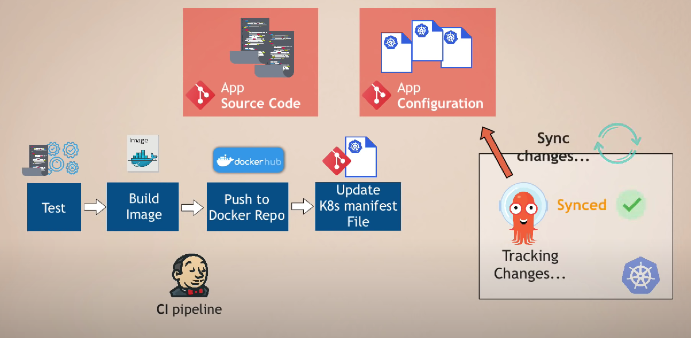
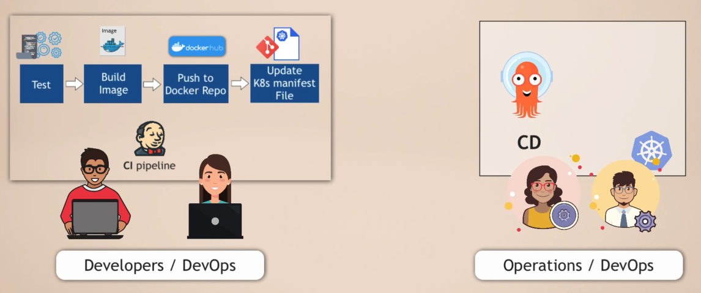
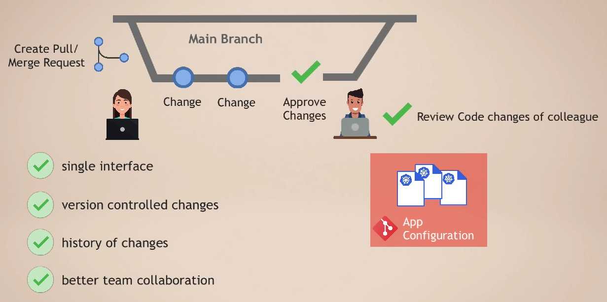

# ArgoCD

ArgoCD is a GitOps tool that helps with your GitOps workflows. ArgoCD can be used as a standalone tool or as a part of your CI/CD workflow. ArgoCD works with Git as a source off truth, with current Kubernetes manifests, or with Helm charts.

### CD workflow with ArgoCD
Challenges with this approach:  
🚫 Install and setup tools like kubetcl  
🚫 Configure access to K8s  
🚫 Configure access to cloud platforms  
🚫 Security challenge  
🚫 No visibility of deployment status  

### How does ArgoCD make the process more efficient ?
CD workflow with ArgoCD:
1. Deploy the ArgoCD in K8s cluster
2. Configure ArgoCD to track Git repository
3. ArgoCD monitors for any changes and applies automatically

### 💡 Best Practice for Git Repository
- Separate git repository for application source code and application configuration (K8s manifest files)
- Even separate git repository for system configurations ?

### 💡 Why Separate Git Repository ?
- Not only Deployment.yaml file, but also ConfigMap, Secret...
- K8s manifest files can change independent of source code
- You don't want to trigger the full CI pipeline, when app source code has not changed
- You don't want complex logic in CI pipeline

Kubernetes manifests can be defined in different ways  
ArgoCD supports: 
- Kubernetes YAML files
- Helm Charts
- Kustomize

### Splitting CI and CD
✔ Automated CI/CD Pipeline  
✔ Separation of concerns

### Benefits of using ArgoCD
- Whole K8s configuration defined as Code in Git repository
- Config files are not applied manually from local laptops
- Same interface for updating the cluster

### What happens if someone updates the cluster manually? 🤔
- ArgoCD watches the changes in the cluster as well
- ArgoCD compares desired configuration in the Git repo with the actual state in the K8s cluster

Actual State ❗= Desired State  
- ArgoCD will detect states diverged
- ArgoCD will sync the changes, overwriting the manual change

### Git as Single Source of Truth
- Guarantees that K8s manifests in Git remains single source of truth
- Full cluster transparency

Actual State == Desired State

### What if we need a way to quickly updaye the cluster anyway? 🤔
- Configure ArgoCD to not sync manual changes automatically
- Send alert instead

Resources:
- [ArgoCD Tutorial](https://www.youtube.com/watch?v=MeU5_k9ssrs)