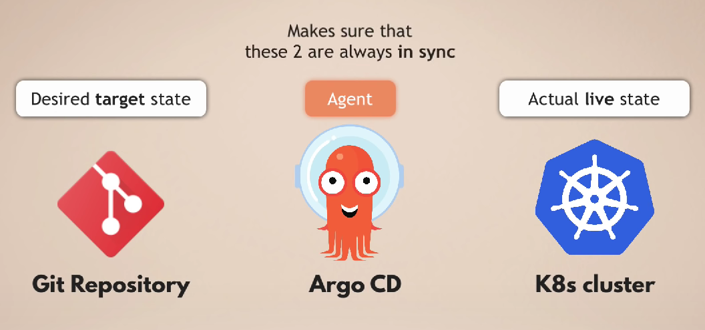
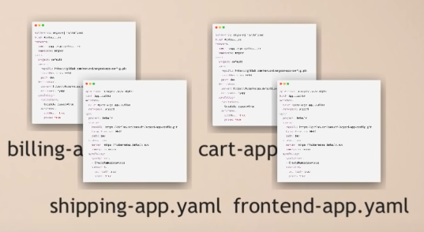
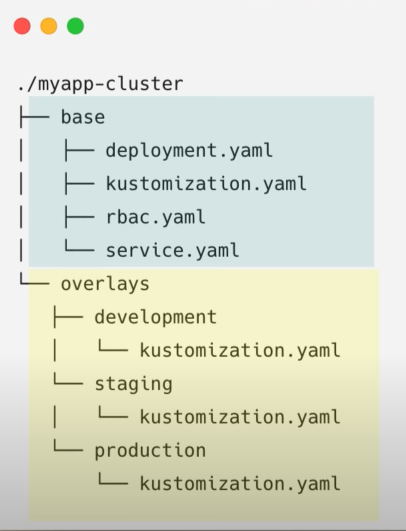
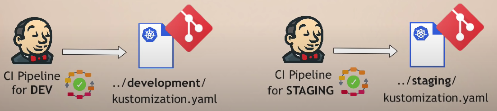

# ArgoCD

### Easy Rollback
No need to manually revert every update in the cluster

### K8s control with Git
- Not everyone should have access to the K8s cluster

    | Task | Development Team | Operations Team | Junior Engineer | Senior Engineer |
    | ---- | ---------------- | --------------- | --------------- | --------------- |
    | Merge Requests | ✔ | ✔ | ✔ | ✔ |
    | Merge | ❌ | ❌ | ❌ | ✔ |

- Manage Cluster Access indirectly via Git
- No need to create ClusterRole & User resources in Kubernetes

### K8s control with ArgoCD
- You don't need to give external cluster access to non human users
- No cluster credentials outside of K8s

### ArgoCD as Kubernetes extension
What does that mean ? 🤔
- ArgoCD uses existing K8s functionalities
- Ex: using `etcd` to store data
- Ex: using **K8s controllers** for monitoring and comparing actual and desired state

Benfits:
- Visibility in the cluster
- Real-time updates application of state
  - Two Scenarios:  
    ✔ Pods created  
    ✔ Healthy status  
     
    ❌ Pods failing
    ❌ Rollback needed

### How to configure ArgoCD? 🤔
1. Deploy ArgoCD into K8s cluster
2. Configure ArgoCD with K8s YAML file
    AddProject
    - Logically group applications
    - And set restrictions:
        - restrict: *what (git repos)* may be deployed
        - restrict: *where(clusters & namespaces)* apps may be deployed to
        

### Working with multiple clusters
- Option 1: Git branch for each environment
    - Deployment
    - Staging
    - Production
- Option 2: Using overlays with kustomize
    

