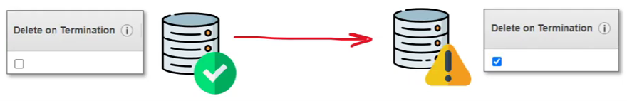

# HashiCorp Terraform

## Configuration Drift

**Configuration Drift** is when provisioned infrastructure has an unexpected configuration change due to:
- Team members manually adjusting configuration options
- malicious actors
- side affects from APIs, SDK or CLIs

eg, a junior developer turns on Delete on Termination for the production database.

Configuration Drift going unnoticed could be loss or breach of cloud services and residing data or result in interrupting of services or unexpected downtime.

### How to detect configuration drift?
- A compliance tool that can detect misconfiguration eg. AWS Config, Azure Policies, *GCP Security Health Analytics
- Built-in support for drift detection eg. AWS CloudFormation Drift Detection
- Storing the expected state eg. Terraform state files

### How to correct configuration drift?
- A compliance tool that can remediate (correct) misconfiguration e.g. AWS Config
- Terraform refresh and plan commands
- Manually correcting the configuration (not recommended)
- Tearing down and settling up the infrastructure again

### How to prevent configuration drift?
- Immutable infrastructure, always create and destroy, never reuse, Blue, Green deployment strategy.
    - Servers are never modified after they are deployed
        - Baking AMI images or containers via AWS Image Builder or Hashicorp Packer, or a build server eg. GCP Cloud Run
- Using GitOps to version control our IaC, and peer review every single via Pull Requests change to infrastructure
