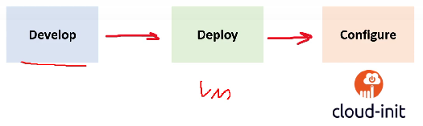
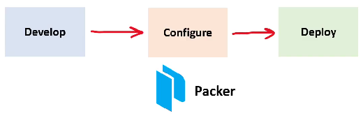
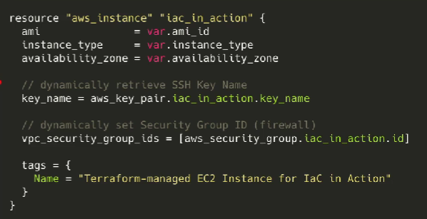

# HashiCorp Terraform

## Mutable vs Immutable Infrastructure
**Mutable Infrastructure**  
A Virtual Machine (VM) is deployed and then a Configuration Management tool like Ansible, Puppet, Chef, Salt or Cloud-Init is used to configure the state of the server.

**Immutable Infrastructure**
A Virtual Machine is launched and provisioned, and then it is turned into a Virtual Image, stored in image repository, that image is used to deployed VM instances.

## What is GitOps
GitOps is when you take Infrastructure as Code(IaC) and you use a git repository to introduce a formal process to review and accept changes to infrastructure code, once that code is accepted, it automatically triggers a deploy

## Immutable Infrastructure Guarantee
Terraform encourages you towards an Immutable Infrastructure architect so you get the following guarantees.

**Cloud Resource Failure** – What if an EC2 instance fails a status check?
**Application Failure** – What if your post installation script fails due to change in package?
**Time to Deploy** – What if I need to deploy in a hurry?

**Worst Case Scenario**
- Accidental Deletion
- Compromised by malicious actor
- Need to change regions (region outage)

**No Guarantee of 1-to-1**
Every time Cloud-Init runs post deploy there is no guarantee its one-to-one with your VMs

**Golden Images**
- Guarantee of 1-to-1 with your fleet
- Increased assurance of consistency, security
- Speeds up your deployments

## HashiCorp
**HashiCorp** is a company specializing in managed open-source tools used to support the development and deployment of large-scale service-oriented software installations

### What is HashiCorp Cloud Platform (HCP)?
HCP is a unified platform to access HashiCorp various products.
HCP services are cloud agnostic
- support for the main cloud service providers (CSPs)
    - eg. AWS, GCP and Azure
- highly suited for multi-cloud workloads

### HashiCorp Products
- **Boundary**: secure remote access to systems based on trusted identity
- **Consul**: service discovery platform, provides a full-featured service mesh for secure service segmentation across any cloud or runtime environment, and distributed key-value storage for application configuration
- **Nomad**: scheduling and deployment of tasks across worker nodes in a cluster
- **Packer**: tool for building virtual-machine images for later deployment
- **Terraform**: Infrastructure as code software which enables provisioning and adapting virtual infrastructure across all major cloud provider
- **Vagrant**: building and maintenance of reproducible software development environments via virtualization technology
- **Vault**: secrets management, identity-based access, encrypting application data and auditing of secrets for applications, systems and users
- **Waypoint**: modern workflow to build, deploy and release across platforms

## What is Terraform?
**Terraform** is an open-source and cloud-agnostic Infrastructure as Code (IaC) tool.

Terraform uses declarative configuration files.

The configuration files are written in HashiCorp Configuration Language

Notable features of Terraform:
- Installable modules
- Plan and predict changes
- Dependency graphing
- State management
- Provision infrastructure in familiar languages
	- via AWS CDK
- Terraform Registry with 1000+ providers

## What is Terraform Cloud?
Terraform Cloud is a Software as a Service (SaaS) offering for:
- Remote state storage
- Version Control integrations
- Flexible workflows
- Collaborate on Infrastructure changes
In a single unified web portal  www.terraform.io/cloud

Terraform Cloud has a generous free-tier that allows for team collaboration for the first 5 users of your organization

In majority of cases you should be using Terraform Cloud.

The only case where you may not want to use it to manage your state file is your company has many regulatory requirements along with a long procurement process so you could use Standard remote backend, Atlantis, or investigate Terraform Enterprise

The underlying software for Terraform Cloud and Terraform Enterprise is known as the **“Terraform Platform”**
