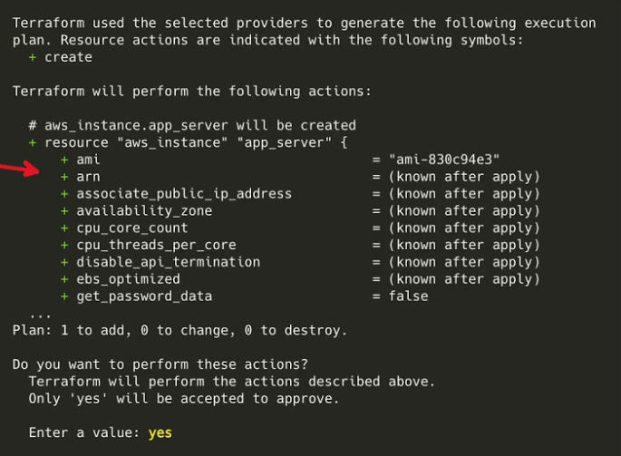
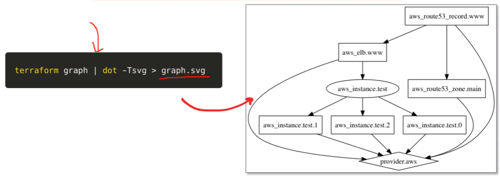
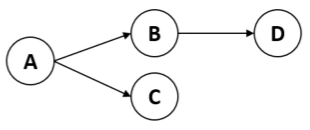
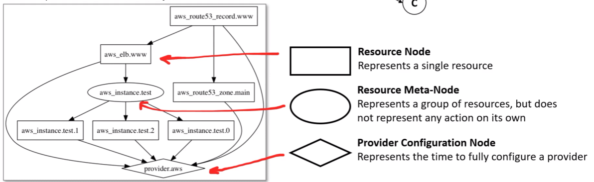
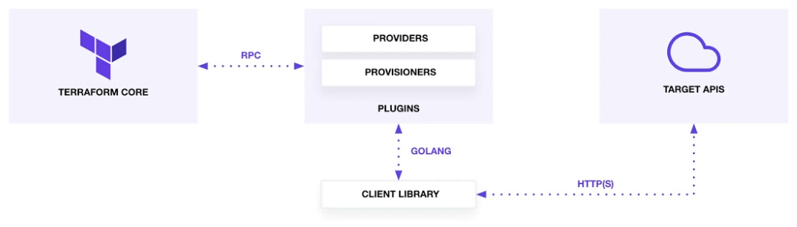

# HashiCorp Terraform

## Terraform Basics

### Terraform Lifecycle

## Change Automation
### What is Change Management?
A standard approach to apply change, and resolving conflicts brought about by change. In the context of Infrastructure as Code (IaC), Change management is the procedure that will be followed when resources are modify and applied via configuration script.

### What is Change Automation?
A way of automatically creating a consistent, systematic, and predictable way of managing change request via controls and policies

Terraform uses Change Automation in the form of Execution Plans and Resources graphs to apply and review complex changesets.

### What is ChangeSet?
A collection of commits that represent changes made to a versioning repository. IaC uses ChangeSets so you can see what has changed by who over time.

Change Automation allows you to know exactly what Terraform will change and in what order, avoiding many possible human errors.

### Execution Plans
An Execution Plan is a manual review of what will add, change or destroy before you apply changes eg. terraform apply

- resources and configuration settings will be listed.
- it will indicate will be added, changed or destroyed if this plan (Plan 1) is approved:
- A user must approve changes by typing: yes

### Visualizing Execution Plans
You can visualize an execution plan as a graph using the terraform graph command
Terraform will output a GraphViz file (you’ll need GraphViz installed to view the file)

### What is GraphViz?
It is an open-source tool for drawing graphs specified in DOT language scripts having the file name extension “gv”

### Resource Graph
Terraform builds a dependency graph from the Terraform configurations, and walks this graph to generate plans, refresh state, and more.

When you use terraform graph, this is a visual presentation of the dependency graph

**What is dependency graph?**  
A dependency graph is a directed graph representing dependencies of several objects towards each other

### Use Cases

**IaC for Exotic Providers**  
Terraform supports a variety of providers outside of GCP, AWS< Azure and sometimes is the only provider.
Terraform is open-source an extendable so any API could be used to create IaC tooling for any kind of cloud platform or technology E.g. Heroku, Spotify Playlists

**Multi-Tier Applications**  
Terraform by default makes it easy to divide large and complex applications into isolate configuration scripts. It has a complexity advantage over cloud-native IaC tools for its flexibility while retaining simplicity over Imperative tools.

**Disposable Environments**  
Easily stand up an environment for a software demo or a temporary development environment

**Resource Schedulers**  
Terraform is not just defined to infrastructure of cloud resource but can be used to dynamic scheduler Docker containers, Hadoop, Spark and other software tools. You can provision your own scheduling grid.

**Multi-Cloud Deployment**  
Terraform is cloud-agnostic and allows a single configuration to be used to manage multiple providers, and to even handle cross-cloud dependencies.

## Terraform Core and Terraform Plugins
Terraform is logically split into two main parts:
1. **Terraform Core**: uses remote procedure calls (RPC) to communicate with Terraform Plugins
2. **Terraform Plugins**: expose an implementation for a specific service, or provisioner

Terraform Core is a statically – compiler binary written in the Go programming language
