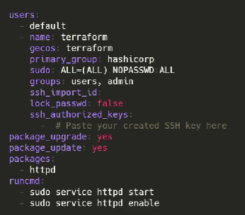
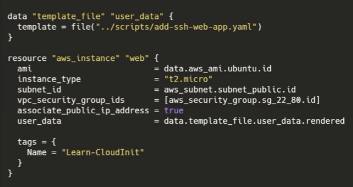
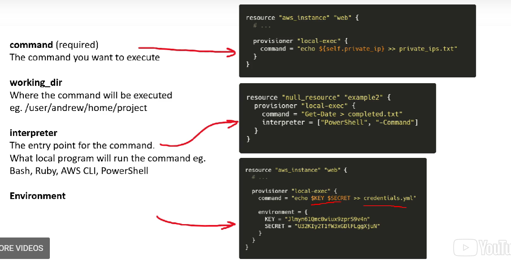
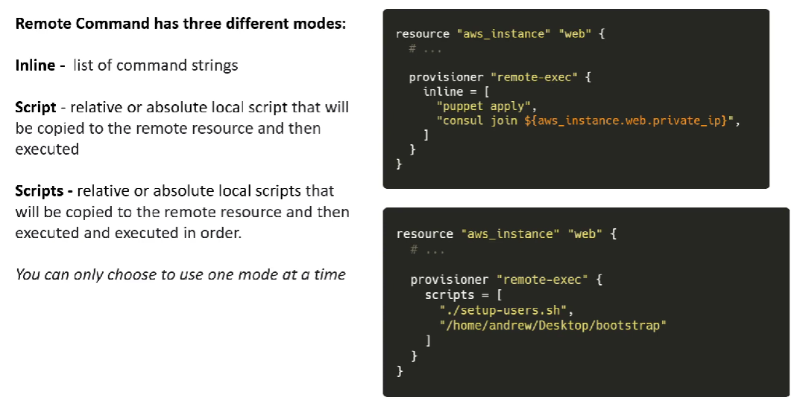

# HashiCorp Terraform

## Terraform Provisioners
Terraform Provisioners install software, edit files, and provision machines created with Terraform

Terraform allows you to work with two different provisioners:
- cloud-init
- Packer

**Cloud-Init** is an industry standard for cross-platform cloud instance initializations. When you launch a VM in a Cloud Service Provider (CSP) you'll provide a YAML or Bash Script.

**Packer** is an automated image-builder service.
You provide a configuration file to create and provision the machine image and the image is then delivered to a repository for use.

Create your own Cloud-init script  
 

Define the template file  

Terraform use to directly support third-party Provisioning tools in the Terraform language Support was deprecated because Terraform considered using Provisioners to be poor practice suggesting better alternatives.

**Cloud-Init** supports *Chef and Puppet*, so you can hust use *Cloud-Init*

## Local-exec Example

## Remote-exec Example

 
