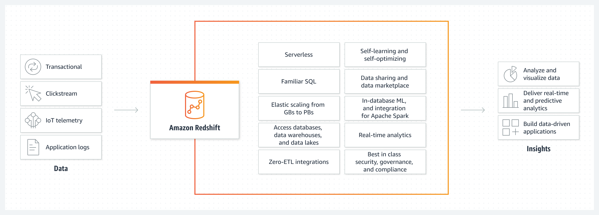
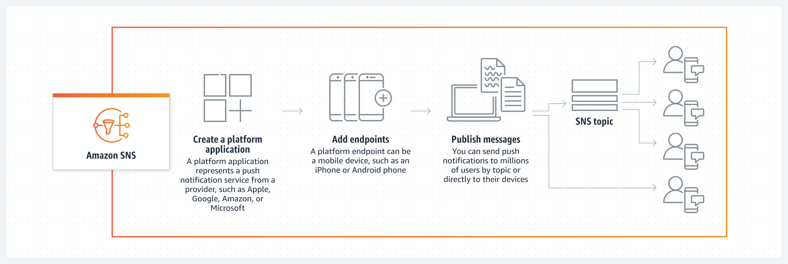
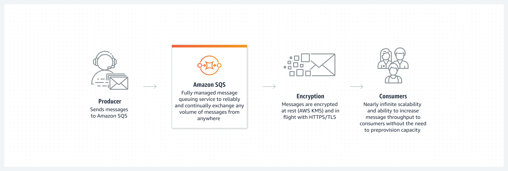
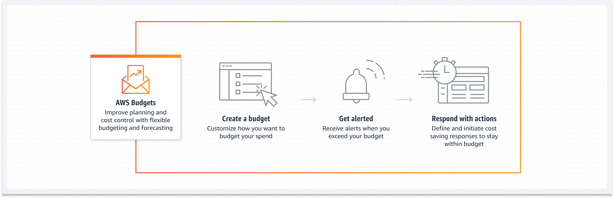
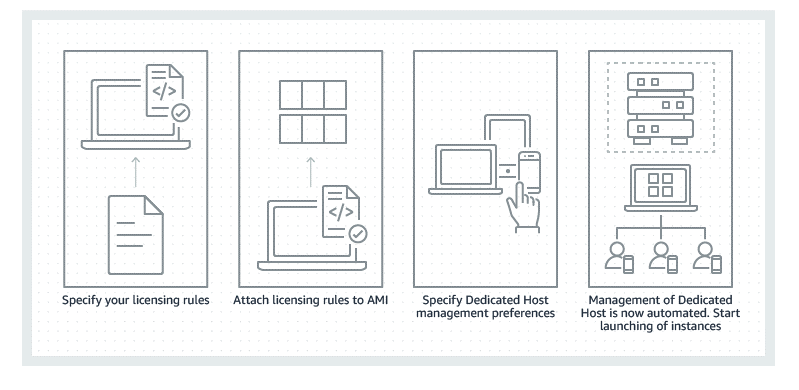
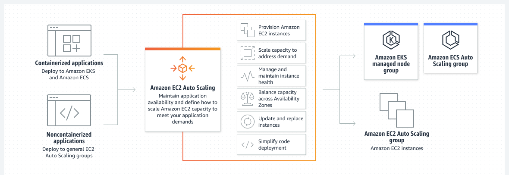
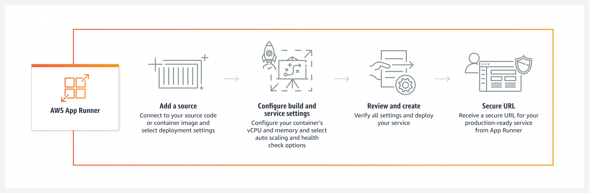
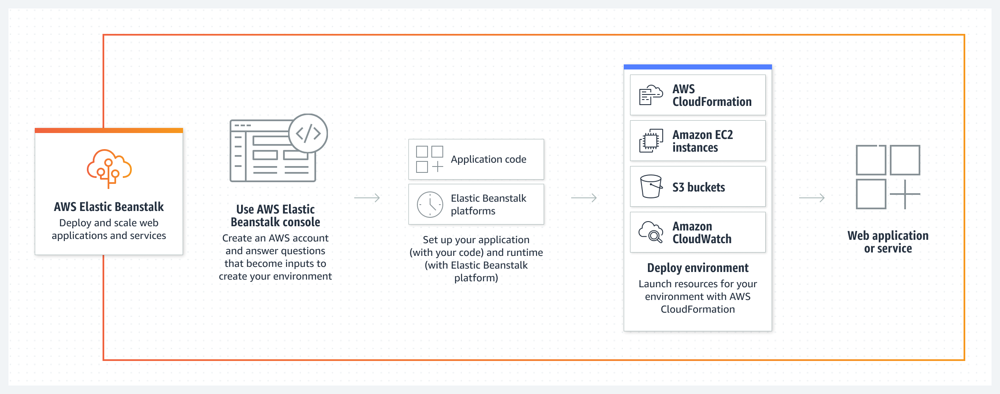
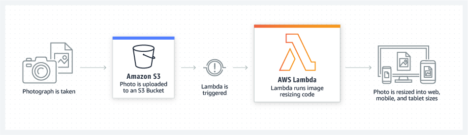

# Amazon Web Services

 
   

## Resources
* [AWS Whitepapers](https://d0.awsstatic.com/whitepapers/aws-overview.pdf)
* [AWS Training Material](https://www.aws.training/LearningLibrary?query=&filters=classification%3A67&from=0&size=15&sort=_score)

## What is Cloud Computing?

Cloud computing is the on-demand delivery of compute power, database, storage, applications and other IT resources through a cloud service platform via the internet with pay-as-you-go pricing.

Cloud computing provides a simple way to access servers, storage, databases and a broad set of application services over the internet. A cloud service platform such as Amazon Web Services owns and maintains the network-connected hardware required for these application services while you provision and use what you need via a web application.

## Advantages of Cloud Computing
* **Trade capital expenses for variable expense** - Instead of having to invest heavily in data centers and servers before you know how you're going to use them, you can pay only when you consume computing resources and pay only for how much you consume. 
* **Benefit from massive economies of scale** - By using cloud computing you can achieve a lower variable cost than you can get on your own. Because usage from hundreds of thousands of customers is aggregated in the cloud, providers such as AWS can achieve higher economies of scale which translates into lower pay as-you-go prices.
* **Stop guessing capacity** - Eliminate guessing on your infrastructure capacity needs. When you make a capacity decision prior to deploying an application, you often end up sitting on expensive idle resources or dealing with limited capacity. With cloud computing these problems go away. You can access as much or as little capacity as you need and scale up and down as required with only a few minute's notice.
* **Increase speed and agility** - In a cloud computing environment, new IT resources are only a click away, which means that your reduce the time to make those resources available to your developers from weeks to just minutes. This results in a dramatic increase in agility for the organization since the cost and time it takes to experiment and develop is significantly lower.
* **Stop spending money running and maintaining data centers** - Focus on projects that differentiate your business not the infrastructure. Cloud computing lets you focus on your own customers, rather than on the heavy lifting of racking, stacking and powering servers.
* **Go global in minutes** - Easily deploy your application in multiple regions around the world with just a few clicks. This means you can provide lower latency and a better experience for your customers at minimal cost.

## Types of Cloud Computing
### Infrastructure as a Service(IaaS)
Infrastructure as a Service (IaaS) contains the basic building blocks for cloud IT and typically provides access to networking features computers(virtual or on dedicated hardware) and data storage space. IaaS provides you with the highest level of flexibility and management control over your IT resources and is most similar to existing IT resources that many IT departments and developers are familiar with today.

### Platform as a Service
Platform as a Service (PaaS) removes the need for organization to manage the underlying infrastructure(usually hardware and operating system) and allows you to focus on the deployment and management of your applications. This helps you be more efficient as you don't need to worry about resources procurement, capacity, planning, software maintenance, patching or any other undifferentiated heavy lifting involved in running your application.

### Software as a Service
Software as a Service (SaaS) provides you with a completed product that is run and managed by the service provider. In most cases, people referring to Software ad a Service are referring to end-user applications. With SaaS offering you do not have to think about how you will use that particular piece of software. A common example of SaaS application is web-based email which you can use to send and receive email without having to manage feature additions to the email product or maintain the servers and operating systems that the email program is running on.

## Cloud Computing Deployment Models
### Cloud
A cloud-based application is fully deployed in the cloud and all parts of the application run in the cloud. Applications in the cloud have either been created in the cloud or have been migrated from any existing infrastructure to take advantage of the benefits of cloud computing. Cloud-based applications can be built on low-level infrastructure pieces or can use higher level services that provide abstraction from the management, architecting and scaling requirements of core infrastructure.

### Hybrid
A hybrid deployment is a way to connect infrastructure and applications between cloud-based resources and existing resources that are not located in the cloud. The most common method of hybrid deployment is between the cloud and existing on-premises infrastructure to extend and grow an organization's infrastructure into the cloud while connecting cloud resources to the internal system. 

### On-premises
The deployment of resources on-premises, using virtualization and resource management tools is sometimes called the 'Private cloud'. On-premises deployment doesn't provide many of the benefits of cloud computing but is sometimes sought for its ability to provide dedicated resources. In most cases, this deployment model is the same as legacy IT infrastructure while using application management and virtualization technologies to try and increase resource utilization.

## Global Infrastructure

The AWS cloud infrastructure is built around AWS regions and Availability Zones. An AWS Region is a physical location in the world where we have multiple Availability Zones(AZ). AZs consist of one or more discrete data centers, each with redundant power, networking and connectivity, housed in separate facilities. These AZs offer you the ability to operate production applications and databases that are more highly available, fault-tolerant and scalable than would be possible from a single data center. The AWS cloud operates in 80 AZs within 25 geographic Regions around the world with announced plans for more AZs and Regions.
Each Amazon Region is designed to be completely isolated from the other Amazon Regions. This achieves the greatest possible fault tolerance and stability. Each Availability Zone is isolated, but the AZs in a Region are connected through low-latency links. AWS provides you with the flexibility to place instances and store data within multiple geographic regions as well as across multiple AZs within each AWS Region. Each AZ is designed as an independent failure zone. This means that Availability Zones are physically separated within a typical metropolitan region and are located in risk flood plains. In addition to discrete uninterruptible power supply and onsite backup generation facilities, data centers located in different AZ are designed to be supplied by independent substations to reduce the risk of an event on the power impacting more than one AZ. Availability Zones are all redundantly connected to multiple tire-1 transit providers.

## Security and Compliance
### Security
Cloud security at AWS is the highest priority. As an AWS customer, you will benefit from a data center and network architecture built to meet the requirements of the most security-sensitive organizations. Security in the cloud is much like security in your on-premise data centers - only without the cost of maintaining facilities and hardware. In the cloud, you don't have to manage physical servers or storage devices. Instead, you use software-based security tools to monitor and protect the flow of information into and out of your cloud resources.

An advantage of AWS Cloud is that it allows you to scale and innovate while maintaining a secure environment and paying only for the services you use. This means that you can have the security you need at a lower cost than in on-premises environment. 

As an AWS customer, you inherit all the best practices of AWS policies, architecture and operational processes built to satisfy the requirements of our most security-sensitive customers. Get the flexibility and agility you need in security controls.

The AWS Cloud enables a shared responsibility model. While AWS manages security **of** the cloud, you are responsible for security **in** the cloud. This means that you retain control of the security you choose to implement to protect your own content, platform, applications, systems and networks no differently than you would in an on-site data center.

AWS provides you with guidance and expertise through online resources, personnel and partners. AWS provided you with advisories for current issues plus you have the opportunity to work with AWS when you encounter security issues.

#### Benefits of AWS Security
* **Keep your data safe**: The AWS Infrastructure puts strong safeguards in place to help protect your privacy. All data is stored in highly secure AWS data centers.
* **Meet Compliance Requirements**: AWS manages dozens of compliance programs in its infrastructure. This means that segments of your compliance have already been completed.
* **Save Money**: Cut costs by using AWS data centers. Maintain the highest standard of security without having to manage your own facility.
* **Scale Quickly**: Security scales with your AWS Cloud usage. No matter the size of your business, the AWS Infrastructure is designed to keep your data safe.

### Compliance
AWS Cloud Compliance enables you to understand the robust controls in place at AWS to maintain security and data protection in the cloud. As systems are built on top of AWS Cloud Infrastructure, compliance responsibilities will be shared. By tying together governance-focused, audit-friendly service features with applicable compliance or audit standards, AWS Compliance enablers build on traditional programs. This helps customers to establish and operate in an AWS security control environment.

The IT infrastructure that AWS provides to its customers is designed and managed in alignment with best security practices and a variety of IT security standards.

# AWS Web Services Cloud

### Topics
* [AWS Management Console](https://github.com/Topsideboss2/DevOpsRoadmap2022/blob/add-folder/Topsideboss2/aws.md#aws-management-console)
* [AWS Comand Line Interface](https://github.com/Topsideboss2/DevOpsRoadmap2022/blob/add-folder/Topsideboss2/aws.md#aws-command-line-interface)
* [Software Development Kit](https://github.com/Topsideboss2/DevOpsRoadmap2022/blob/add-folder/Topsideboss2/aws.md#software-development-kit)
* [Analytics](https://github.com/Topsideboss2/DevOpsRoadmap2022/blob/add-folder/Topsideboss2/aws.md#analytics)
* [Application Integration](https://github.com/Topsideboss2/DevOpsRoadmap2022/blob/add-folder/Topsideboss2/aws.md#application-integration)
* [Cloud Financial Management](https://github.com/Topsideboss2/DevOpsRoadmap2022/blob/add-folder/Topsideboss2/aws.md#cloud-financial-management)
* [Compute Services](https://github.com/Topsideboss2/DevOpsRoadmap2022/blob/add-folder/Topsideboss2/aws.md#compute-services)
* [Contact Center](https://github.com/Topsideboss2/DevOpsRoadmap2022/blob/add-folder/Topsideboss2/aws.md#contact-center)
* [Containers](https://github.com/Topsideboss2/DevOpsRoadmap2022/blob/add-folder/Topsideboss2/aws.md#containers)
* [Database](https://github.com/Topsideboss2/DevOpsRoadmap2022/blob/add-folder/Topsideboss2/aws.md#database)
* [Developer Tools](https://github.com/Topsideboss2/DevOpsRoadmap2022/blob/add-folder/Topsideboss2/aws.md#developer-tools)
* [Management and Governance](https://github.com/Topsideboss2/DevOpsRoadmap2022/blob/add-folder/Topsideboss2/aws.md#management-and-governance)
* [Migration and Transfer](https://github.com/Topsideboss2/DevOpsRoadmap2022/blob/add-folder/Topsideboss2/aws.md#migration-and-transfer)
* [Networking and Content Delivery](https://github.com/Topsideboss2/DevOpsRoadmap2022/blob/add-folder/Topsideboss2/aws.md#networking-and-content-delivery)
* [Security, Identity and Compliance](https://github.com/Topsideboss2/DevOpsRoadmap2022/blob/add-folder/Topsideboss2/aws.md#security-identity-and-compliance)
* [Storage](https://github.com/Topsideboss2/DevOpsRoadmap2022/blob/add-folder/Topsideboss2/aws.md#storage)

## AWS Management Console
Access and manage AWS through the AWS Management Console, a simple and intuitive user interface. You can also use the AWS Mobile Application to quickly view resources on the go.

## AWS Command Line Interface
The AWS Command Line Interface(CLI) is a unified tool to manage your AWS services. With just one tool to download and configure, you can control multiple AWS services from the command line and automate them through scripts.

## Software Development Kit
The Software Development Kits(SDKs) simplify using AWS services in your applications with an Application Program Interface (API) tailored to your programming language or platform.

## Analytics
**Topics**
### * [Amazon Athena]()
Amazon Athena is an interactive query service that makes it easy to analyze data in Amazon S3 using standard SQL. Athena is serverless, so there is no infrastructure to manage, and you pay only for the queries that you run.

Athena is easy to use, simply point your data in Amazon S3, define the schema, and start querying using standard SQL. Most results are delivered within seconds. With Athena, there is no need for complex extract, transform, load (ETL) jobs to prepare your data for analysis. This makes it easy for anyone with SQL skills to quickly analyze large-scale datasets.

### * [Amazon CloudSearch]()
Amazon CloudSearch is a managed service in the AWS Cloud that makes it simple and cost-effective to set up, manage and scale a search solution for your website or application.

### * [Amazon Kinesis]()
Amazon Kinesis makes it easy to collect, process and analyze real-time streaming data so you can get timely insights and react quickly to new information. Amazon Kinesis offers key capabilities to cost-effectively process streaming data at any scale, along with the flexibility to choose the tools that best suit the requirements of your application. With Amazon Kinesis, you can ingest real-time data such as video, audio, application logs, website clickstreams, and IoT telemetry data for machine learning, analytics, and other applications. Amazon Kinesis enables you to process and analyze data as it arrives and respond instantly instead of having to wait until all your data is collected before the processing can begin.

Amazon Kinesis currently offers four services: 
1. Amazon Kinesis Data Firehose
2. Amazon Kinesis Data Analytics
3. Amazon Kinesis Data Streams
4. Amazon Kinesis Video Streams

### * [Amazon Redshift]()
Amazon Redshift is the most widely used cloud data warehouse. It makes it fast, simple and cost-effective to analyze all your data using standard SQL and your existing Business Intelligence tools. 

## Application Integration
**Topics**
### * [Amazon Simple Notification Service]()
Amazon Simple Notification Service(Amazon SNS) is a highly available, durable, secure, fully managed pub/sub messaging service that enables you to decouple microservices, distibuted systems, and serverless applications. Using Amazon SNS topics, your publisher system can fan out messages to a large number of subscriber endpoints for parallel processing, including Amazon SQS queues, AWS Lambda functions and HTTP/S webhooks. Additionally SNS can be use to fan out notifications to end users using mobile push, sms and email.

### * [Amazon Simple Queue Service]()
Amazon Simple Queue Service (SQS) is a fully managed message queueing service that enables you to decouple and scale microservices, distributed systems and serverless applications. Using SQS, you can send, store and receive messages between software components at any volume without losing messages or requiring other services to be available. 

SQS offers two types of messages queues: 
1. Standard Queues
2. FIFO Queues

## Cloud Financial Management
**Topics**
### * [AWS Cost Explorer]()
AWS Cost Explorer has an easy-to-use interface that lets you visualize, understand and manage your AWS costs and usage over time.

### * [AWS Budgets]()
AWS Budgets gives you the ability to set custom budgets that alert you when your costs or usage exceed (or are forecasted to exceed) your budgeted amount. Budgets can be tracked at the monthly, quarterly or yearly level. One can also customize the start and end dates. You can further refine your budgets to track costs associated with multiple dimensions such as AWS service, linked account, tag, and others. Budget alerts can be sent via email and/or Amazon SNS topic.

## Compute Services
**Topics**
### * [Amazon EC2]()
Amazon Elastic Compute Cloud (Amazon EC2) is a web service that provides secure, resizable compute capacity in the cloud. It is designed to make web-scale computing easier for developers.
Instance Types:
1. On-Demand Instances
2. Spot Instances

3. Reserved Instances
4. Savings Plans
5. Dedicated Hosts

### * [Amazon EC2 Auto Scaling]()
Amazon EC2 Auto Scaling helps you maintain application availability and allows you to automatically add or remove EC2 instances according to conditions you define.

### * [Amazon App Runner]()
Amazon App Runner is a fully managed service that makes it easy for developers to quickly deploy containerized web applications and APIs, at scale and with no prior infrastructure experience required. With App Runner, rather than thinking about servers or scaling, you have more time to focus on your applications.

### * [AWS Elastic Beanstalk]()
AWS Elastic Beanstalk is an easy to use service for deploying and scaling web applications and services developed with Java, .NET, PHP, Node.js, Python, Ruby, Go, and Docker on familiar servers such as Apache, Nginx, Passenger and Internet Information Services(IIS). 

You can simply upload your code and AWS Elastic Beanstalk automatically handles the deployment, from capacity provisioning, load balancing and auto-scaling to application health monitoring. At the same time, you retain full control over the AWS resources powering your application and can access the underlying resources at any time. 

### * [AWS Fargate]()
AWS Fargate is a compute engine for Amazon ECS that allows you to run containers without having to manage servers or clusters. With AWS Fargate, you no longer have to provision, configure, and scale clusters of virtual machines to run containers.

AWS Fargate removes the need for you to interact with or think about servers or clusters. Fargate lets you focus on designing and building your applications instead of managing the infrastructure that runs them.

### * [AWS Lambda]()
AWS Lambda lets your run code without provisioning or managing servers. You pay for the compute time you consume- there is no charge when your code is not running. With Lambda, you can run code for virtually and type of application or backend service- all with zero administration. You can set up your code to automatically trigger from other AWS services or you can call it directly from any web or mobile app.

## Contact Center
## Containers
## Database
## Developer Tools
## Management and Governance
## Migration and Transfer
## Networking and Content Delivery
## Security, Identity and Compliance
## Storage