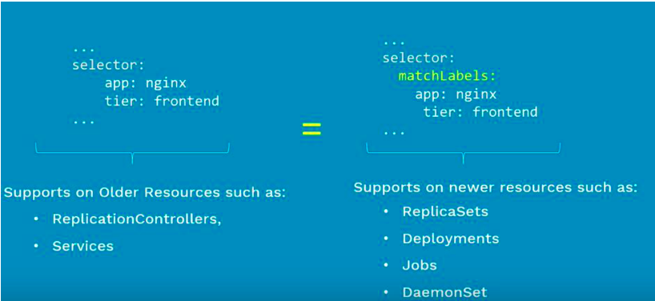

# what is replicaSet all about?

maintain a stable set of replica pods running at any given time

- ensures that a specified number of pods are running at any time

1. if there are access pods, they get killed and vice versa.
1. new pods are launched when they get failed, get deleted and terminated

- replicaSet & Pods are associated with 'labels'

# replication controller vs replicaSet

- replicaset is the next generation of replication controller
- both sreve the same purpose.

# labels & selectors

when pods are scaled. how are these pods managed at such large scale?


# comparision

## equality based selectors

### **Operators**

= and ==

### **examples:**

environment = production
tier!= frontent

### **commandline:**

`kubectl get pods -l environment=production`

### **in manifest**

```
selector:
  environment: production
  tier: frontend
```

## set-based selectors

### **operators**

in notin exists

### **examples**

environment in production (production, qa)  
tier notion(frontend, backend)

### **commandline**

`kubectl get pods -l environment in(production)`

### **In manifest**

```
selector:
  matchExpressions:
   - {key: environment, operator:in,values:[prod,qa]}
   - {key: tier, operator:Notion}
```

supports: Job, deployment, replicaSet, daemonSet


