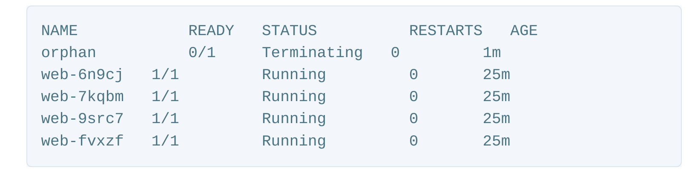

# kubernetes replicaset

- replicaSets are kubernetes controllers that are used to maintain the number and running state of pods.
- it uses labels to select pods that it should be managing
- a pod must labeled with a matching label to the replicaSet selector, and it must not be already owned by another controller so that the replicaSet can acquire it.
- pods can be isolated from a replicaSet by simply changing their labels so that they no longer match the replciaSet's selector.
- replicaSets can be deleted with or without deleting their dependent pods.
- you can easily control the number or replicas (pods) the replicaSet should maintain through
- you can also configure the replicaSet to autoscale based on the amount of cpu load the node is experiencing.
- you may have read about replicationControllers in older kubernetes documentation, articles or books. replicaSets are the successors of replicationControllers. as they provide more features.
- a kubernetes pod serves as a deployment unit for the cluster.
- it may contain one or more continers.
- however, containers (and accordingly, pods) are short-lived entities.
- a container hosting a php applicaiton, for example may experience an unhandled code exception causing the process to fail, effectively crashing the container. of course the perfect solution for such a case is to refactor the code to properly handle exceptions.
- but, till that happens we need to keep the application running and the business going. In other words, we need to restart the pod whenever it fails.
- in parallel, developers are monitoring, investing and fixing any errors that make it crash.
- at some point, a new version of the pod is deployed, monitored and maintained. it's an ongoing process that is part of the devOps practice.

another requirement is to keep a predefined number of pods running, if more pods are up, the additional ones are terminated. similartly, of one or more pods failed, new pods are activated until the desired count is reached.

a kubernetes replicaSet resource was designed to address both of those requirements. it creates and maintains a specific number of similar pods (replicas).

# how does replcaSet manage pods?

- in order for a replicaset to work, it needs to know which pods it will manage so that if can restart the failing ones or kill the unneeded.
- it also requires to understand how to create new pods from scratch in case it needs to spawn new ones.
- a replicaset uses labels to match the pods that it will manage. it also needs to check whether the target pod is already managed by another controller (like a deployment or another replicaSet). so, for example if we need our replicaSet to manage all pods with the label role=webserver, the controller will search for any pod with that label. it will also examine the ownerReferences field of the pod's metadata to determine whether or not this pod is already owned by another controller. if it isn't the replicaset will start controlling it. subsequently, the ownerReferences field of the target pods will be updated to reflect the new owner's data.

to be able to create new pods if necessary, the replcaSet definition includes a template part containing the definition for new pods.

# removing a pod from a replicaset

you can remove (not delete) a pod that is managed by a replicaSet by simple changing its label. Let's isolate one of the pods

> kubectl edit po \<pod name>

then once the yaml file is opened, change the pod label to be role=isolated or anything different than role=web. in a few moments, run kubectl get pods. you will notice that we have five pods now. that's because the replicaSet dutifylly created a new pod to reach the desired number of four pods. the isolated one is still running, but is no longer managed by the replicaSet.

# scaling and autoscaling replicaSets

you can easily change the number of pods a particular replicaSet manages in one of two ways:

- edit the controllers configuration by using kubectl edit rs replicaset_name and change the replicas count up or down as you desire.
- use kubectl directly. for example, `kubectl scale -replicas=2 rs/web` here I'm scaling down the replicaSet used in the article's example to manage two pods instead of four. The replicaset will get rid of two pods to maintain the desired count. if you followed the previous section, you may find that the number of running pods is three instead of two; as we isolate one of the pods so it is no longer managed by our replicaSet.

> kubectl autoscale rs web --max=5

this will use the horizontal pod autoscaler (HPA) with the replicaSet to increase the number of pods when the cpu load gets higher, but it should not exceed five pods. when the load decreases, it cannot have less than the number of pods specified before.

# best practices

the recommended practice is to always use the replicaSet's template for creating and managing pods. however, because of the way replicaSets work, it you create a bare pod (not owned by any controller) with a label that matches the replicaSet selector, the controller will automatically adopt it. this has a number of undesirable consequences.

> kubectl apply -f pod.yml

give it a few moments for the image to get pulled and the container is spawned then run kubectl get pods.

the pod is being terminated by the replicaSet because, by adopting it, the controller has more pods than it was configured to handle. So, it is killing the excess one.

another scenario where the replicaset won't terminate the bare pod is that the latter gets created before the replicaSet does.

the bottom line: you should never create a pod with a label that matches the selector of a controller unless its template matches the pod definition. the more-encouraged procedure is to always use a controller like a replicaSet, or even better, a deployment to create and maintain your pods.

# deleting replicaset

> kubectl delete rs \<replicaset_name>

> kubectl delete -f \<definition_file.yml>

the above commands will delete the replicaSet and all the pods that it manages. but sometimes you may want to just delete the replicaset resource, keeping the pods unowned (orphaned). maybe you want to manually delete the pods and don't want the replicaSet to restart them. this can be done using the following command:

> kubectl delete rs \<replicaSet_name> --cascade=false

if you run `kubectl get rs` now you should see that there are no replicaSets there. Yet if you run kubectl get pods, you should see all the pods that were managed by the destroyed replicaSet still running.

the only way to get those pods managed by a replicaSet again is to create this replicaSet with the same selector and pod template as the previous one. If you need a different pod template, you should consider using a deployment instead, which will handle replacing pods in a controlled way.
