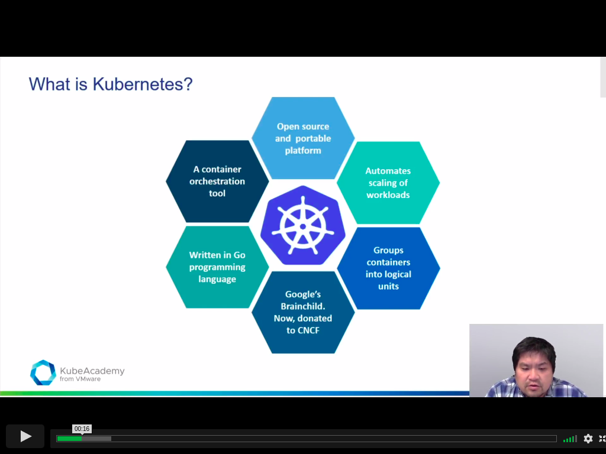
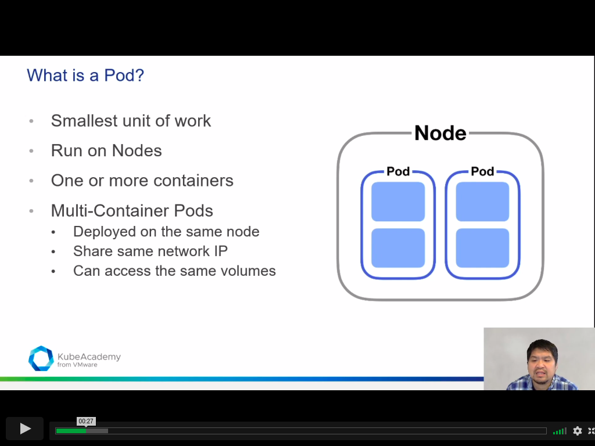
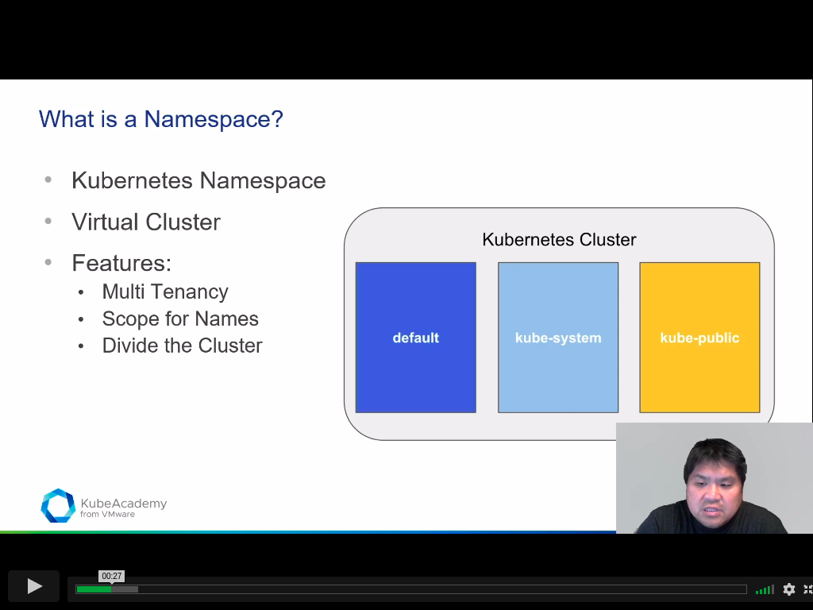
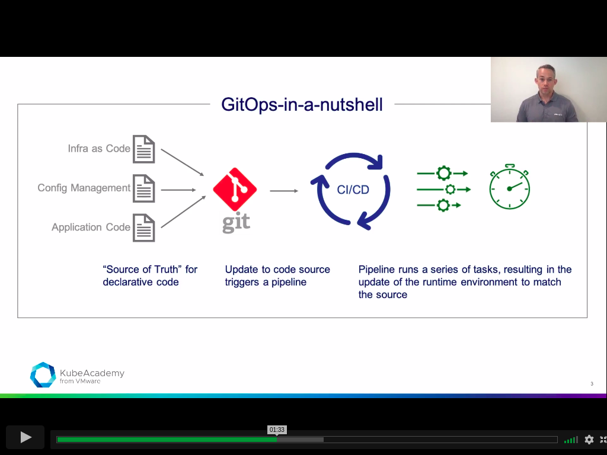
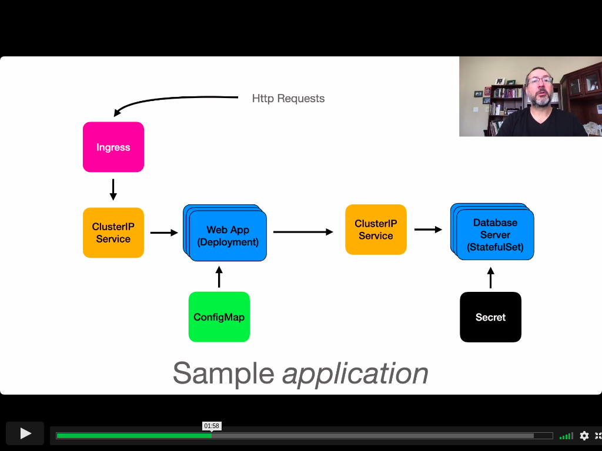
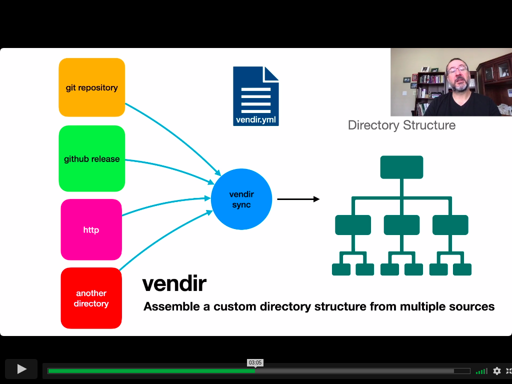
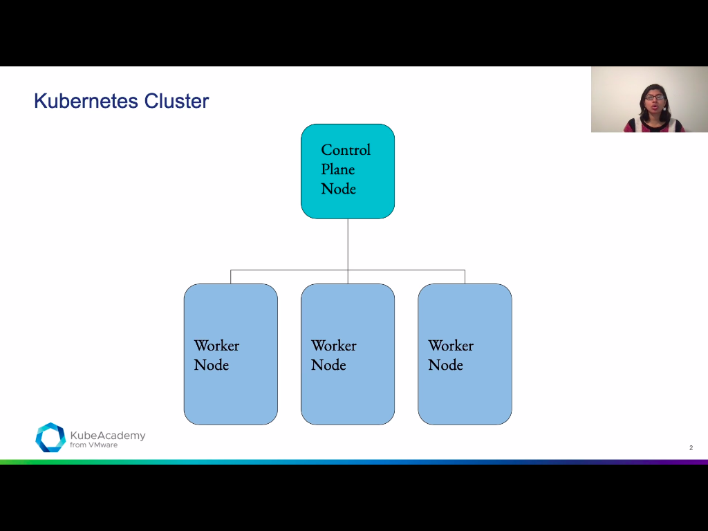

# what is kubernetes

# Kubernetes alternative

- manual
- infrastructure automation
- others: rancher, swarm and nomad
- serverless
- SaaS (software as a service) and no code

# what is a pod.

# what is namespace

in linux namespace helps to isolate system from network or process, eg network namespace or process namespace.

# GitOps

# configMap

- a namespaced resource for storing configuration

## motivation

- to decouple an application from its configuration for flexibility

## what kind of data?

- use for non-confidential data (for confidential data, use secrets)
- can provide either textual or binary data (has both data and binaryData fields)

## how much data?

- cannot exceed 1MiB in size

## binding

- binding information from a configMap to a container using:
  - environment variables, or
  - a volume mounted onto the container filesystem

# what is carvel?

- open source project
- a cloud-native computing foundation (cncf) project

carvel is ... a suite of tools that assist with building, configuring, and deploying applications to kubernetes

## philosphy

- each has a single purpose and a well-defined scope
  - follows the unix philosophy: can compose the commands together into a chain of processes
- tools not coupled to one another
  - free to use any or all of the tools
  - can be used in conjunction with non-carvel tools (e.g. helm, kubectl)

## kbld

build and publish container images, resolve image refrences to digests

- pluggable image build mechanism, works with dockerfile, cloud-native buildpacks (pack cli), and more
- eliminates issues with deploying the right image by using image digest references, which uniquely identify an image.

## imgpkg

build and publish application bundles as oci images

- build bundles
- stores manifest referncing all bundle dependencies
- can push, pull, copy images to, from and between container registries.

## kapp

a k8s client, alternative to, or complements the kubectl cli

- introduces the notion of the application as a higher level construct for deployment
- can deploy, list, inspect, or delete apps.
- can determine changes when redeoploying, can display diff's
- favors waiting until kubernetes resources are reconciled and reports success of operation.

# what are labels?

labels are key/value pairs that are attached to objects, such as pods.

labels allow for efficient queries that can be used to create associations between kubernetes resources, for example:

- a service can use teh selector property to identify which pods to proxy
- a pod can use the nodeSelector property to identify on which nodes it can be scheduled.

## motivation

labels enable users to map their own organizational structures onto system objects in a loosely coupled fashion.

# what is kubernetes cluster?

kubernetes cluster is a collection of processes/containers that runs on different nodes that join together to make a cluster. some run control plane node and some run on worker node.

## control plane node

- also known as master node
- schedules applications
- scales applications
- maintains cluster state
- implements updates

## worker node

- runs applications

# what is OPA?

opa decouples policy decision-making from policy enforcement. when your software needs to make policy desicions it queries opa and supplies structured data (e.g. json) as input. opa accepts arbitrary structured data as input.
