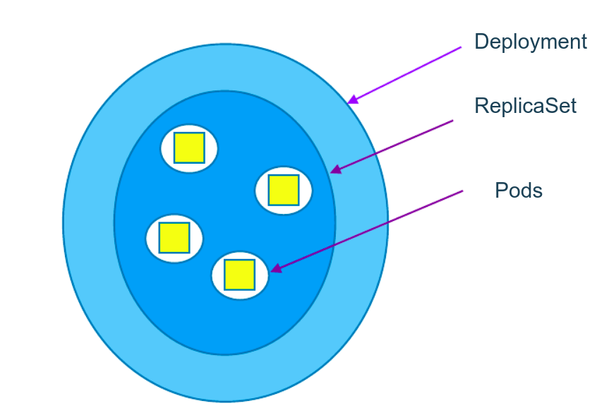
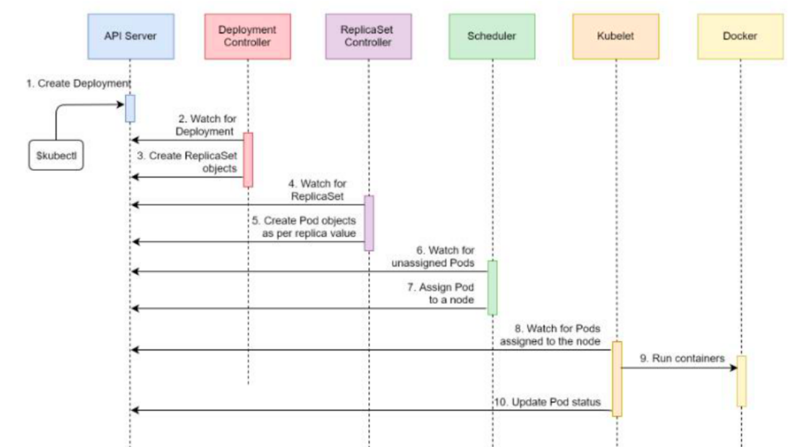
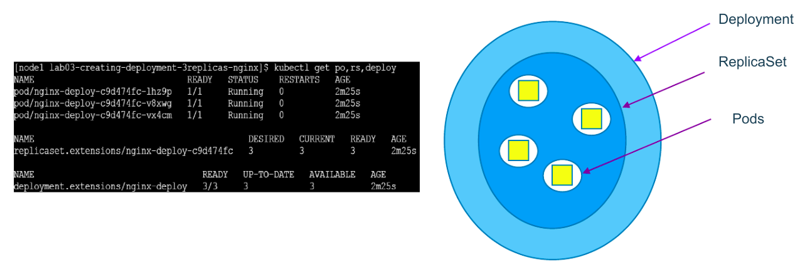

> scenario: you deployed an app few months ago. Now you want to upgrade your app from v1 to v2.

> _can you upgrade with zero downtime?_  
> _can you upgrade sequentially one after another?_  
> _can you pause and resume upgrade process?_  
> _Rollback upgrade to previous stable release_

# deployment

a deployment cotroller provides declarative updates for pods and replicaSets.

you describe a desired state in a deployment, and the deployment controller changes the actual state to the desired state at a controlled rate. you can define deployments to create new replicaSets, or to remove existing deployments and adopt all their resources with new deployments.

### **how is it different form replicaSet?**

replicaSet doesn't provide features like updates & roll backs.

# a single deployment manifest file

we can manage all 3 different objects(Pods, replicaSet & deployment) using a single deployment manifest file

# Features of deployment

- multiple replicas
- upgrade
- rollback
- scale up or down
- pause & resume

# deployment types - recreate

- recreate

### **how it works?**

shutting down version A and then making sure, version A is turned off... then bringing up version B.

### demerits

during this, there will be a downtime of the service.  
easy to setup.

# deployment type - rolling updates

- rolling update (ramped or incremental)

- default updating strategy in kubernetes.
- it can take sometime for a complete update process

### How it works?

slowly rollout a version of app by replacing instances one after the other untill all the instances are successfully rolled out.  
assume that there are 10 instances of version A which is running behind the LB. Then update strategy starts with one instance of version B is deployed when version B is ready to accept traffic, one instance of version A is removed from the pool

# deployment type - canary

- canary

- ideal deployment method for someone who want to test newer version before it is deployed 100%.

### how if works?

this method is all about gradually shifting production traffic from version A to version B.

lets imagine that there are about 10 instances of app version A running inside a cluster. You use canary deployment when you don't want to upgrade all of your instances. let's say you upgraded your 2 instances of version A to version B then do some testing. if test results are good, then you upgrade remaining 8 instances to version B. say, your version B is ready, then you completely shut down version A.

# deployment type - blue green

- blue green

- instance roll out and roll back.

### how it works?

using this method, version b (which is green) is deployed along side version A (which is blue) with exactly same amount if instances.  
after testing new version with all the requirement, the traffic is switched from version A to version B at the lb level.

# a typical deployment workflow

# deployment => pods + replicaSet

# 3 instances of same nginx apps running in the form of pods

> kubectl get po,rs,deploy -o wide

> kubectl get deploy -l app=nginx-app

> kubectl get rs -l app=nginx-app

> kubectl rollout status deployment/nginx-deploy

# scaling up

> kubectl scale deployment nginx-deploy --replicas=6
