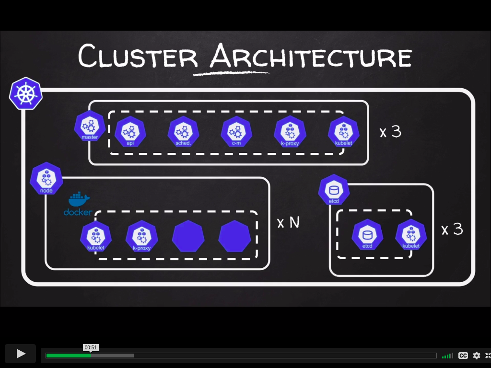
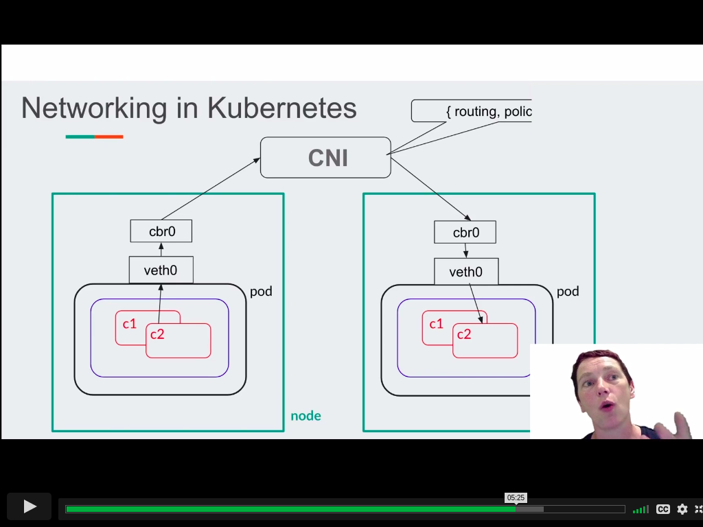

# Kubernetes In Depth

## kubernetes architecture

### apiserver

- serves api
- validation
- authentication
- authorization
- admission control
- serialization
- reads/wirets <> etcd

### etcd

- key/value data store
- uses raft algo to do leader election and log replication

### controller manager

- reads data from etcd via api server
- makes all decision based on the api server

### scheduler

reads config form etcd via api server, whether it needs to do something.

### kube-proxy

- responsible for programming ip tables

# an introduction to cni

## networking in kubernetes

- cross node pod to pod communication
- services discovery
- services exposure for external access
- network security
- high availability

## what is cni?

cni stands for container network interface

- specification to configure network interfaces in linux containers
- concerned with connecting (add) and disconnecting (delete) containers to network

## why cni?

- networking can be highly environment specific
- different projects seek to solve the networking challenges - with potential overlap
- makes sense to have standards for a common.

