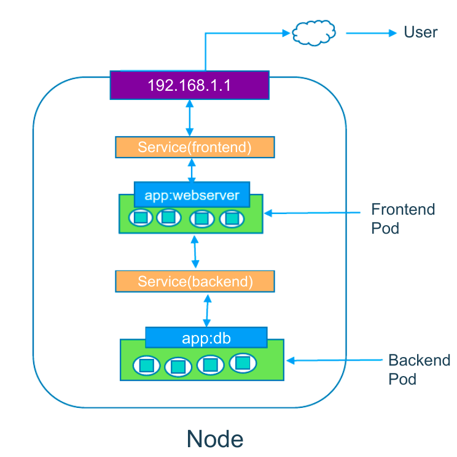
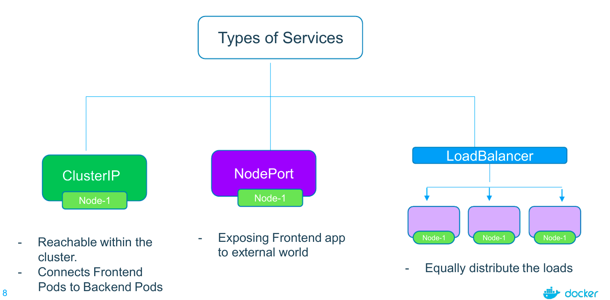
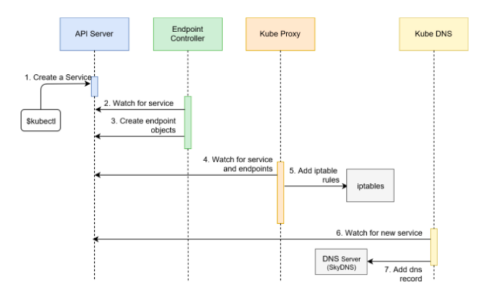
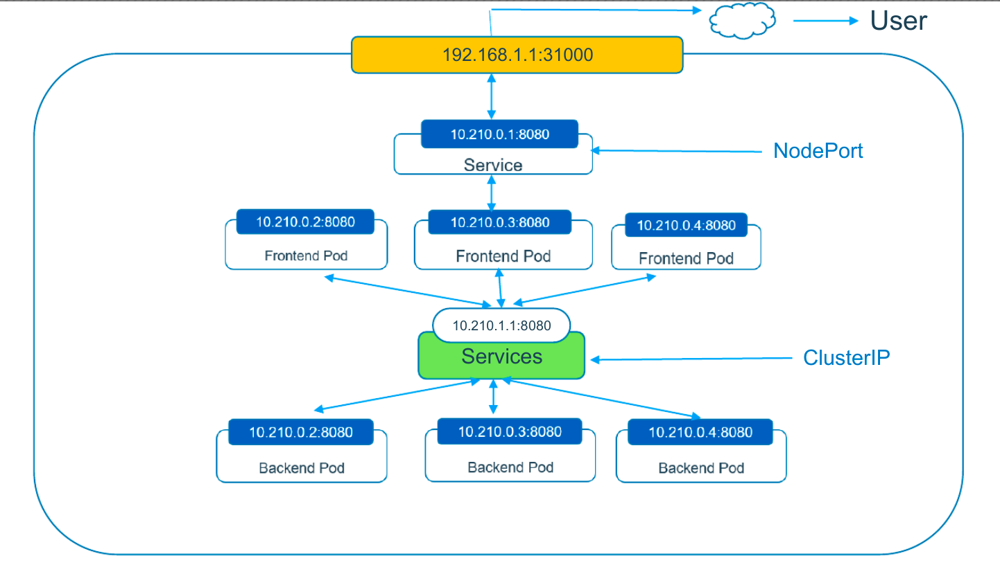

**imagine that, you have been asked to deploy web app**

_how does this frontend web app exposed to outside world?_  
_how do front end app connected to backend database?_  
_how do we resolve pod IP changes, when they die?_

# services

- an abstraction which defines a logical set of pods and a policy by which to access them (sometimes this pattern is called a micro-service).
- services acts as a layer above the pods. It is always aware of the pods that it manages: their count, their internal IP addresses, the ports they expose and so on.
- service can be defined using a yaml or json file that contains the necessary definitions.

## can we use kubernetes service without pods?

**Yes!**

- access an api outside your cluster (examples: wheather, stocks, currency rates).
- you have a service in another kubernetes cluster that you need to contact
- you need to shift some of your infrastructure components to kubernetes. but, since you're still evaluating the technology, you need it to communicate with some backend applications that are still outside the cluster.
- you have another service in another namespace that your need to reach.

# a typical service workflow

- imagine you need to deploy one full fledge app which consists of frontend app & backend app
- how can we restrict access of backend database to only within the kubernetes cluster

