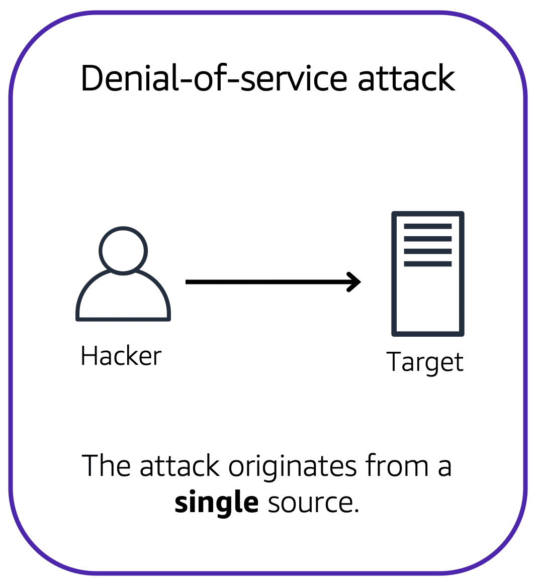

# user permissions and access

## aws identity and access management (IAM)

aws identity and access management (IAM) enables you to manage access to aws services and resources securely

IAM gives you the flexibility to configure access based on your company's specific operational and security needs.

- iam users, groups and roles
- iam policies
- multi-factor authentication

## aws account root user

when you first create an aws account, you begin with an identity know as the root user.

the root user is accessed by signing in with the email address and password that you used to create your aws account. you can think of the root user as being similar to the owner of the coffee shop. it has complate access to all the aws services and resources in the account

**best practice**

do not use the root user for everyday tasks.

Instead use the root user to create your first IAM user and assing it permissions to create other usres.

then, continue to create other iam users, and access those identities for performing regular tasks throughout aws. only use the root user when you need to perform a limited number of tasks that are only available the root user.

## iam users

an iam user is an identity that you create in aws. it represents the person or application that interacts with aws services and resources. it consists of a name and credentials.

by default when you create a new iam user in aws it has no permissions associated with it. to allow the iam user to perform specific actions in aws, such as launching an amazon ec2 instance or creating an amazon s3 bucket, you must grant the iam user the necessary permissions.

**best practice**

we recommend that you create individual iam users for each person who needs to access aws

even if you multiple employees who require the same level of access. you should create individual iam users for each of them, this provides additional security by allowing each iam users to have a unique set of security credentials.

## iam policies

an iam policies is a document that allows or denies permissions to aws services and resources.

iam policies enable you to customize users level of access to resources. fo eg you can allow users to access all of the amazon s3 bucket within your aws account or only a specific bucket.

**best practice**

follow the security principle of least privilege when grating permissions.

by following this principle you help to prevent users or roles from having more permissions that need to perform their tasks.

for eg if an employee needs access to only a specific bubket, specify the bucket in the iam policy. do this instead of granting the employee access to all of the bucket in your aws account.

## iam groups

an iam group is a collection of iam users. when you assign an iam policy to a group all users in the group are granted permissions specified by the policy.

assigning iam policies at the group level also makes it easier to adjust permissions when an employee transfers to a different job.

## iam roles

when the employee needs to switch to a different task. they give up their access to one workstation and gain access to the next workstation. the employee can easliy switch between workstations, but at any given point in time, they have access to only a single workstation. this same concept exists in aws with iam roles.

an iam role is an identity that you can assume to gain temporary access to permissions.

before an iam user, application or service can assume an iam role, they must be granted permissions to switch to the role. when someone assumes an iam role, they abandon all previous permissions that they had under a previous role and assume the permissions of the new role.

**best practice**

iam roles are ideal for situations in which access to services or resources needs to be granted temporarily, instead of long-term.

## multi-factor authentication

in iam multi-factor authentication (mfa) provides an extra layer of security for your aws account.

## aws organizations

suppose that your company has multiple aws accounts. you can use aws organizations to consolidate and manage multiple aws accounts within a central location.

when you create an organization, aws organizations automatically creates a root, which is parent container for all the accounts in your organization

in aws organization you can centrally control permissions for the accounts in your organization by using service control policies (scps). scps enable you to place restrictions on the aws services, resources and individual api actions that users and roles in each account can access.

## organizational units

in aws organizations you can group accounts into organizational untis (ous) to make it easier to manage accounts with similar business or security requirements. when you apply a policy to an ou, all the accounts in the ou automatically inherit the permissions specified in the policy

by organizing separate accounts into ous you can more easily isolate workloads or applications that have specific security requirements.

# compliance

## aws artifact

depending on your company industry you may need to uphold specific standards, an, audit or inspection will ensure that the company has met those standards.

aws artifact is a service that provides on-demand access to aws security and compliance reports and select online agreements. aws artifact consists of two main sections aws artifact agreements and aws artifact reports.

### aws artifact agreements

in aws artifact agreements you can review accept and manage agreements for an individual account and for all you acounts in aws organizations. different types of agreements are offered to address the needs of customers who are subject to specific reqgualtions.

### aws artifact reports

aws artifact reports provide compliance reports from third-party auditors. these auditors have tested and verified that aws is compliant with a variety of global regional and industry specific seccurity standards and regulations.

# denial of service attacks

## denial of service attacks

a denial of service (DoS) attack is a deliberate attempt to make a website or application unavailable to users.

an attacker might flood a website or application with excessive network traffic until the targeted website or application becomes overloaded and is no longer able to respond. if the website or application becomes unavailable, this denies services to users who are trying to make legitimate requests.

## distributed denail of service attacks

now suppose that the prankster has enlisted the help of friends.

in a distributed denial of service (DDoS) attack, multiple sources are used to start an attack that aims to make a website or application unavailable. this can come from a group of attackers, or even a single attackers. the single attacker can use multiple infected computers (also known as bots) to send excessive traffic to a website or application.

to help minimize the effect of dos and ddos attacks on your application, you can use aws sheild

## aws shield

aws shield is a service that protects applications against ddos attacks. aws shield provides two levels of protection

### aws shield standard

aws shield standard automatically protects all aws customers at no cost. it protects your aws resources from the most common, frequently occuring types of ddos attacks.

as network traffic comes into your application, aws shield standard uses a variety of analysis techniques to detect malicious traffic in real time and automatically mitigates it.

### aws shield advanced

aws shield advanced is a paid service that provides detailed attack diagonostics and the ability to detect and mitigate sophisticated ddos attacks.

it also integrates with other services such as amazon cloudfront amazon route 52, and elastic load balancing additionally you can integrate aws shield with aws waf by writing custom rules to mitigate complex ddos attacks.

# additional security services

## aws key management service (aws kms)

you must ensure that your applications data is secure while is storage (encryption at rest) and while it is transmitted, known as encryption in transit

aws key management service (aws kms) enables you to perform encryption operations through the use of cryptographic keys. a cryptographic key is a random string of digits used for locking (encryption) and unlocking (decryption) data. you can aws kms to create, manage and use cryptographic keys, you can also control the use of keys across a wide range of services and in your applications.

with aws kms you can choose the specific levels of access control that you need for your keys. for eg you can specify which iam users and roles are able to manage keys. alternatively you can temporarily disable keys so that they are no longer in use by anyone. your keys never leave aws kms and you are always in control of them.

## aws waf

aws waf is a web application firewall that helps you monitor network requests that come into your web applications.

aws waf works together with amazon cloudfront and an application load balancer. recall the network access control lists that you learned about in an earlier module. aws waf works in a similar way to block or allow traffic. however it does this by using a web access control list (acl) to prevent you aws resources.

suppose that your application has been receiving malicious network requests from several IP addresses. you wan to prevent these requests from continuing to access your application, but you also want to ensure that legitimate users can still access it.

however if a request came from one of the blocked ip addresses that you have specified in the web acl, it is denied access.

## amazon inspector

amazon inspector helps to improve the security and compliance of applications by running automated security assessments. it checks applications for security vulnerabilities and deviations from security best practices, such as open access to amazon ec2 instances and installations of vulnerable software versions.

after amazon inspector has performed an assessment, it provides you with a list of security findings.

## amazon guard duty

amazon guard duty is service that provides intelligent threat detection for your aws infrastructure and resources. it identifies threats by continuously monitoring the network activity and account behavior within your aws environment.

after you enable guardduty for you aws account, guardduty begins monitoring your network and account activity, you do not have to deploy or manage any additional security software. guarduty then continuously analyzes data from multiple aws sources, including vpc flow logs and dns logs.

if guardduty detects any threats you can review detailed findings about them from the aws management console. findings include recommended steps for remediation.

# amazon cloudwatch

## amazon cloudwatch

amazon cloudwatch is a web service that enables you to monitor and manage various metrics and cofigure alarm actions based on data from those metrics

cloudwatch uses metrics to represent the data points for your resources. aws services send metrics to cloudwatch. cloudwatch then uses these metrics to create graphs automatically that show how performance has changed over time.

## cloudwatch alarms

with cloudwatch you can create alarms that automatically perform actions if the value of your metric has gone above or below a predefined threshold.

## cloudwatch dashboard

the cloudwatch dashboard feature enables you to access all the metrics for your resources from a single location

# aws cloudtrail

## aws cloudtrial

aws cloudtrail records api calls for your account. the recorded information includes the identity of the API caller, the time of the API call, the source ip address of the api caller and more. you can think of cloudtrail as a trail of breadcrums that someone has left behind them.

event are typically updated in cloudtrail within 15 minutes after an api call. you can filter events by specifying the time and date that an api call occurred, the user who requested the action, the type of resource that was involved in the api call

## cloudtrail insights

within cloudtrail, you can also enable cloudtrail insights. this optional feature allows cloudtrail to automatically detect unusual api activities in your aws account.

# aws trusted advisor

## aws trusted advisor

aws trusted advisor is a web service that inspects you aws environment and provide real-time recommendation in accordance with aws best practices.

trusted advisor compares its findings to aws best practices in five categories, cost optimization, performance, security fault tolerance and service limits.

## aws trusted advisor dashboard

when you access the trusted dashboard on the aws management console, you can review completed checks for cost optimization, preformance, security fault tolerance and service limits.
