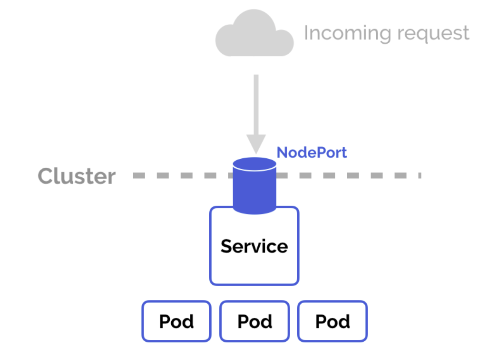
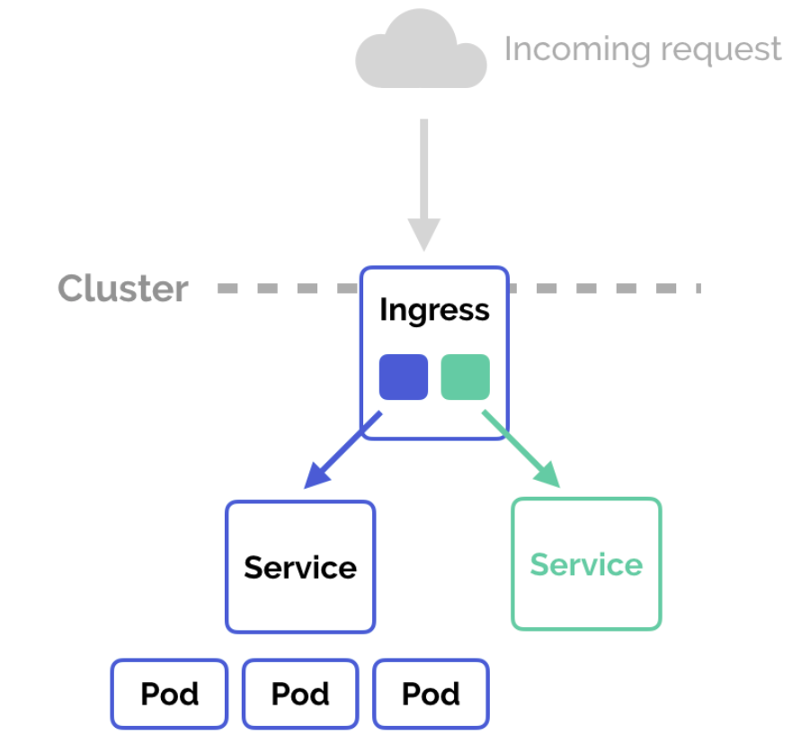

# what is ingress?

- in kubernetes, an ingress is an object that allows access to your kubernetes services from outside the kubernetes cluster. you configure access by creating a collection of rules that define which inbound connections reach which services.
- this lets you consolidate your routing rules into a single resource. for example you might want to send requests to example.com/api/v1 to an api-v1 service, and requests to example.com/api/v2/ to the api-v2 servier. with an ingress, you can easily set this up without creating a bunch of loadbalancers or exposing each service on the node.

# kubernetes ingress vs loadbalancer vs nodeport

## node port

- nodeport is a configuration setting you declare in a service's yml. set the service spec's type to nodePort. then, kubernetes will allocate a specific port on each node to that service, and any request to your cluster on that port gets forwarded to the service.

## load balancer

- you can set a service to be of type loadbalancer the same way you'd set node port - specify the type property in the service's yml.
- this is typically heavily dependent on the cloud provider.
- every time you want to expose a service to the outside world. you have to create a new loadbalancer and get an ip address.

## ingress

- nodePort and loadbalancer let you expose a service by specifying that value in the service's type. Ingress on other hand, is a completely independent resource to your service. you declare, create and destroy it separately to your services.
- this makes it decoupled and isolated from the services you want to expose. it also helps you to consolidate routing rules into one place.
