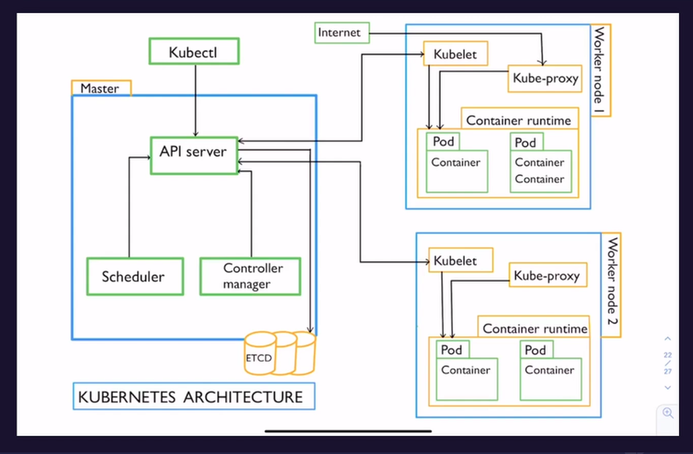

# kubernetes objects

write the output of the code to yml file.

> kubectl create deploy nginx --image=nginx --image=nginx --port=80 --dry-run=client -oyml > deploy.yml

deploy usign yml file

> kubectl create -f deploy.yml

list all the deployment resources

> kubectl get deploy

get all the api resources

> kubectl api-resources

# kubernetes namespace

namespaces is a way to provide isolated environments to teams/groups

create ns

> kubectl create ns dev

change default context

> kubectl config set-context --current --namespace=dev

check default context

> kubectl config view --minify | grep namespace

# labels and selectors

labels are key value pairs that are attached to pods, it is used to add attributes to create meaningful kubernetes objects.

get pod list along with labels

> kubectl get po --show-labels

add label to pod

> kubectl label pod nginx demo=true
