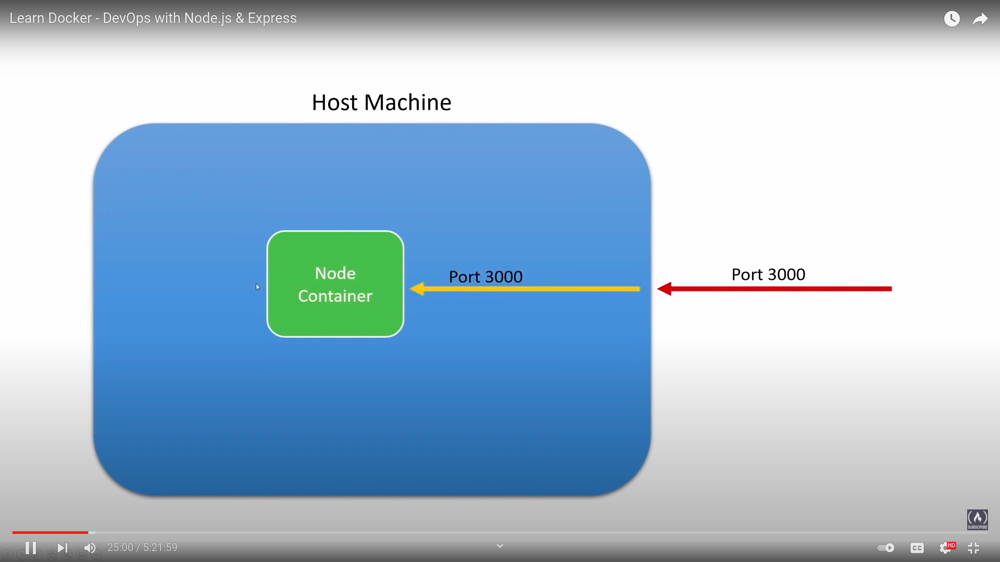

# learn docker

```dockerfile
FROM node
WORKDIR /app
COPY package.json
RUN npm install
COPY . ./
```

> we are first copying package.json then the entire directory as at each layer caches the values. most of the time we only change the code and less often we change so docker won't run entire layer all at once, it use the cache value

## purging all unused or dangling image, containers, volumes and networks

`docker system prune`

docker provides a single command that will clean up any resources - images, containers, volumes and networks - that are dangling (not tagged or associated with a container)

`docker system prune -a`

to additionally remove any stopped containers and all unused images (not just dangling images)

## build image

`docker build . -t <app-name>`

## run container from image

`docker run -d --name <container name> <image name>`

- -d to run container in detached mode
- --name to specify name of container

## port forwarding



this means every request on our local machine will be redirected to port on our container

## volumes

volumes are the preferred mechanism for persisting data generated by and used by docker containers. whille bind mounts are dependent on the directory structure and os of the host machine, volumes are completely managed by docker

`docker run -p <local machine port>:<container port> -v <local machine dir>:<container dir> --name <container name> <image name>`

to preserve some files in container means even if file in our local machine changes we don't want to the changes to take place in container

`docker run -p <local machine port>:<container port> -v <local machine dir>:<container dir> -v <container dir> --name <container name> <image name>`

to prevent container makes changes in our local system

`docker run -p <local machine port>:<container port>:ro -v <local machine dir>:<container dir> -v <container dir> --name <container name> <image name>`

## deleting volumes

by default when we delete container, volumes won't be automatically gets deleted

when deleting container to delete volume associated with that container

`docker rm -fv <container name>`

also

`docker volume prune`

## passing environment variable

you can do `--env <value>` or `-e <value>` or you add path to env file `--env-file <path to env file>`
