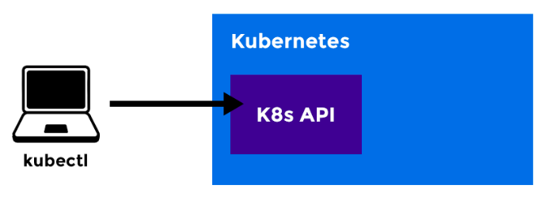
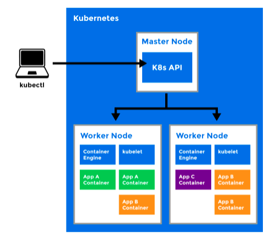

# what is kubernetes

kubernetes (commonly referred to as k8s) is an orchestration engine for container technologies such as docker and rkt that is taking over the devOps scene in the last couple of years.

kubernetes can speed up the development process by making easy, automated deployments, updates and by managing our apps and services with almost zero downtime. it also provides self-healing. kubernestes can detect and restart services whena process crashes inside the container.

# what is k8s is made up of?

## kubectl:

- a cli tool for kubernetes

## master node

- the main machine that controls the nodes
- main entrypoint for all administrative tasks
- it handles the orchestration of the worker nodes

## worker node

- it is a worker machine in kubernetes (used to be known as minion).
- this machine performs the requested tasks. each node is controlled by the master node.
- runs pods (that have containers inside them)
- this is where the docker engine runs and takes care of downloading images and starting

## kubelet

- primiary node agent
- ensures that containers are running and healthy

## kubernetes pods

- a pod can host multiple containers and storage volumes
- pods are instances of deployment
- one deployment can have multiple pods.
- with horizontal pod autoscaling, pods of a deployment can be automatically started and halted based on cpu usage.
- containers within the same pod have access to shared volumes
- each pod has its unique ip address within the cluster
- pods are up and running until someone (or a controller) destroyes them
- any data saved inside the pod will disappear without a persistent storage

## deployment

- a deployment is a blueprint for the pods to be created
- handles update of its respective pods.
- a deployment will create a pod by its spec from the template.
- their target is to keep the pods running and update them (with rolling-update) in a more controlled way.
- pods resource usage can be specified in the deployment
- deployment can scale up replicas of pods.
- kubernetes deployment

## secret

- a secret is an object, where we can store sensitive informations like usernames and passwords
- in the secret files, values are base64 encoded.
- to use a secret, we need to refer to the secret in our pod
- or we can put it inside a volume and mount that to the container.
- secrets are not encrypted by default. for encryption we need to create an encryptionConfig.

## service

- a service is responsible for making out pods discoverable inside the network or exposing them to the internet
- a service identifies pods by its labelSelector

## clusterIP

- the deployment is only visible inside the cluster
- the deployment gets an internal clusterIP assigned to it.
- traffic is load balanced between the pods of the deployment

## node port

- the deployment is visible inside the cluster
- the deployment is bound to a port of the master node
- each node will proxy that port to your srevice
- the service is available at http(s)://
- traffic is load balanced between the pods of deployment

## load balancer

- the deployment gets a public ip address assigned
- the service is available at http(s)://:80
- traffic is load balanced between the pods of the deployment
