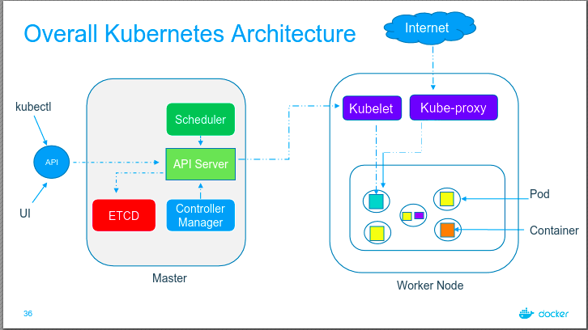

# a cargo ship

carries containers across the sea  
host application as containers ~ worker nodes

# control ships

managing & monitoring of the cargo ships  
manage, plan, schedule, monitor ~ master

# ship cranes

identifies the placement of containers  
identifies the right node to place a containers ~ kube-scheduler

# cargo ship profiles

ha database - which containers on which ships? when was it loaded?  
ha database - which containers on which ship? when was it loaded? ~ the ETCD cluster

# offices in dock

- operation team office ~ ship handling control
- cargo team office ~ verify if containers are damanged
- it & communication office - communication in between various ships

- node controllers - take care of nodes | responsible for onboarding new nodes in a cluster | availability of nodes
- replicas controller - ensures that desired number of containers are running at all times
- controller manager - manages all these controllers in place

# kube api server

- a primary management component of k8s
- responsible for orchestrating all operations within a cluster
- exposes k8s api, used by external users to perform management operations in the cluster and number of controller to monitor the state of the cluster.

# captain of the ship ~ kubelet

- manages all sort of activity on the ship
- let master ship knows they are interested to join
- sending reports back to master about the status of the ship
- sending reports about the status of the containers.

agent which runs on each nodes of the container

# kube-proxy service

how will web server running on one worker node reach out to db server on another worker node

communication between worker nodes - kube-proxy

# overall kubernetes architecture

