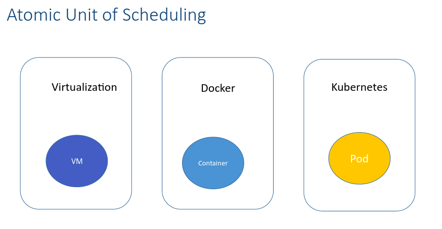
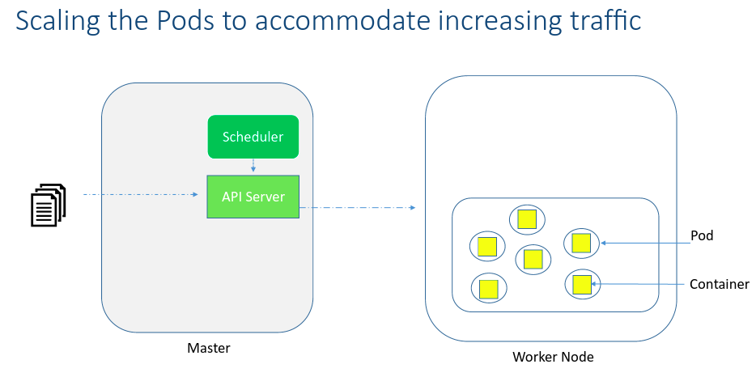
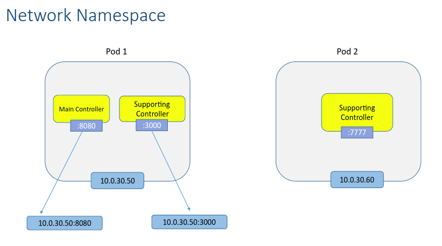
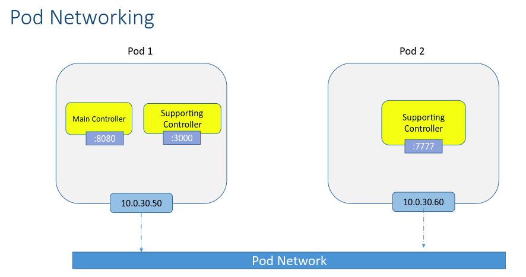
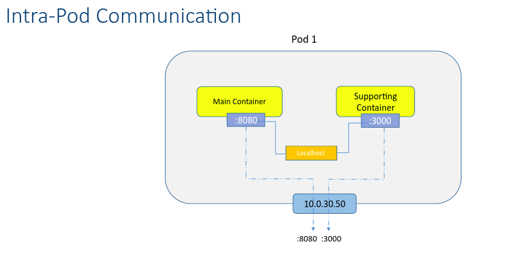
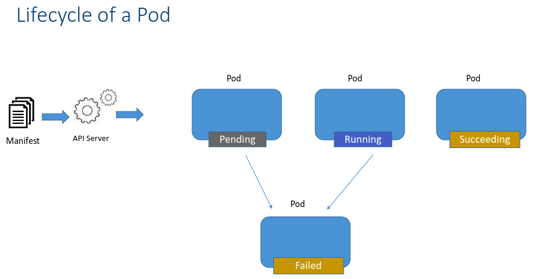
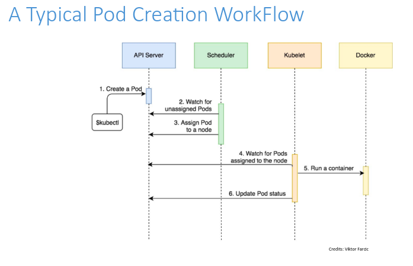

# pods

## atomic unit of scheduling

## how pods are deployed

## scaling the pods to accomodate increasing traffic

## network namespace

## pod networking

## intra-pod communication

## lifecycle of a pod

## a typical pod creation workflow

