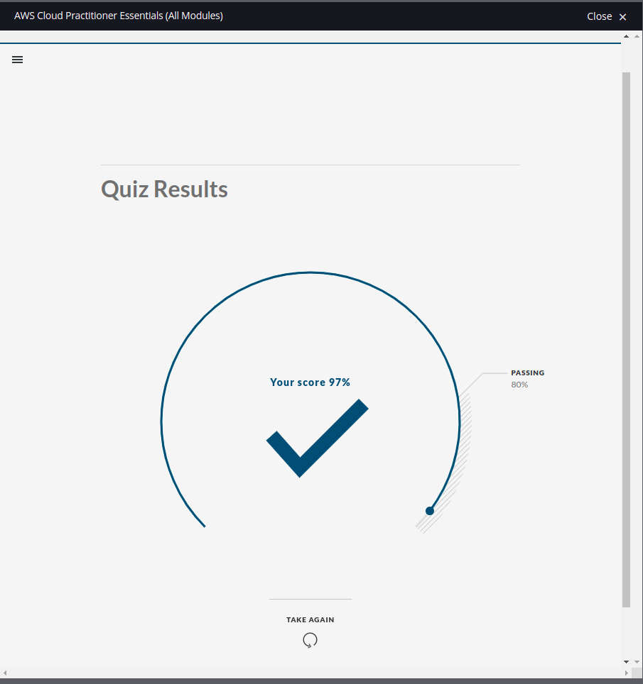

# My Progress

#### 08-Jan-2022 (Day 1)

- Learnt what is devOps is and what it is not. Complete devOps cycle . Watched devOps 2022 road map. [Youtube](https://www.youtube.com/watch?v=7l_n97Mt0ko)

#### 09-Jan-2022 (day 2)

- completed [90 days of dsa day 2](https://github.com/MichaelCade/90DaysOfDevOps/blob/main/Days/day02.md)
- started [The 50 Most Popular Linux & Terminal Commands](https://www.youtube.com/watch?v=ZtqBQ68cfJc)

#### 10-Jan-2022 (day 3)

- completed Chapter 1: The Linux Foundation / Introduction

#### 13-Jan-2022 (day 4)

- Chapter 2: Linux Philosophy and Concepts (completed)
- Chapter 3: Linux Basics and System Startup (started)
  - Introduction
  - The Boot Process

#### 14-Jan-2022 (day 5)

- Chapter 3: Linux Basics and System Startup (continue)
  - Boot Loader in Action

#### 15-Jan-2022 (day 6)

- Chapter 3: Linux Basics and System Startup (continue)
  - Inital RAM Disk
  - Text Mode Login
  - The Linux Kernal
  - /sbin/init
  - Startup Alternatives
  - Linux Filesystem Basics
  - Partitions and Filesystems
  - The Filesystem Hierarchy Standard

#### 16-Jan-2022 (day 7)

- Chapter 3: Linux Basics and System Startup (finished)
  - Choosing a Linux Distribution
  - Question to Ask When Choosing a Distribution
  - Linux Installation
- Chapter 4: Graphical Interface (finished)
  - Introduction
  - Graphical Desktop
  - Session Mangement
  - Basic Operations
- Chapter 5: System Configuration from the Graphical Interface (finished)
  - System, Display, Date and Time Settings
  - Network Manager
  - Installing and Updatign Software
- Chapter 6: Common Applications (finished)
- Chapter 7: Command Line Operations (started)
  - The Command Line
  - sudo
  - Switching Between the GUI and the Command Line
  - Virtual Terminals (VT)
  - Turning On or Off the Graphical Desktop

#### 17-Jan-2022 (day 8)

- Chapter 7: Command Line Operations (continue)
  - Basic Operations
  - Locating Application
  - Accessing Directories
  - Exploring Filesystem
  - Hard Links
  - Soft Links
  - Navigating the Directory History
  - Viewing Files
  - Touch
  - mkdir, rmdir
  - Moving, Renaming or Removing a File
  - Standard File Streams
  - I/O Redirection
  - pipes
  - locate

#### 18-Jan-2022 (day 9)

- Chapter 7: Command Line Operations (finished)
  - Wildcards and Matching File Names
  - Find
  - Package Mangers: Two Levels
- Chapter 8: Finding Linux Documentation (finished)
  - man
  - Other Documentation Sources
  - Package Documentation
- Chapter 9: Processes
  - What is Process?
  - Process Types
  - Process Scheduling and States
  - Terminating a Process
  - User and Group IDs

#### 19-Jan-2022 (day 10)

- chapter 9: Processes (finished)
  - More About Priorities
  - Load Averages
  - Interpreting Load Averages
  - Background and Foreground Processes
  - Managing Jobs
  - top
- Chapter 10: File Operations (start)
  - Filesystem Varieties
  - Linux Partitions
  - Mount Points
  - Mounting and Unmounting
  - NFS and Network Filesystems
  - Filessystem Architecture

#### 20-Jan-2022 (day 11)

- Chapter 10: File Operations (finished)
  - Filesystem Varieties
  - Comparing Files and File types
  - Backing Up and Compressing Data
- Chapter 11: Text Editors (finished)
  - nano
  - gedit
  - More Advanced Editors: vi and emacs
- Chapter 12: User Environment
  - Accounts, Users and Groups

#### 21-Jan-2022 (day12)

- Chapter 12: User Environment
  - Accounts, Users and Groups
    - The root Account
    - su and sudo
  - Environment Variables

#### 22-Jan-2022 (day 13)

- Chapter 12: User Environment (finished)
  - Enviroment Variables
    - Setting Environment Variables
    - The HOME Varible
    - The PATH Variable
    - SHELL variable
  - Recalling Previous Commands
    - Using history environment variables
    - Finding previously used commands
    - Executing Previous commands
    - Keyboard shortcuts
  - File Permissions
    - File Ownership
- Chapter 13: Manupipulating Text (started)
  - cat and echo
    - cat
  - Working with Large Files
    - head
    - tail
    - viewing compressed files
  - sed and awk
    - sed
    - sed command syntax
    - sed basic operations

#### 23-Jan-2022 (day 14)

- Chapter 13: Manipulating text (finished)
  - sed and awk
    - sed basic operations
    - awk
    - awk basic operations
  - file manipulation utilities
    - sort
    - uniq
    - paste
    - join
    - split
    - Regular expression
  - grep and strings
    - grep
    - strings
  - Miscellaneous text utilities
    - tr
    - tee
    - wc
    - cut
- Chapter: 14: Network Operations
  - Network Addresses and DNS
    - IP Addresses
    - IPv4 and IPv6
    - decoding IPv4
    - class A network
    - class B network
    - class C network
    - ip address allocation
    - name resolution

#### 24-Jan-2022 (day 15)

- Chapter 14: Network Operations (finished)
  - Networking Configuration and Tools
    - The Ip utility
    - pint
    - route
    - traceroute
  - Non-Graphical Browsers
    - wget
    - curl
  - transfering files
    - FTP
    - ssh
    - copying files securely with scp

#### 25-Jan-2022 (day 16)

- [DevOps Prerequisites course](https://www.youtube.com/watch?v=Wvf0mBNGjXY&t=0s)
  - Linux Basics
    - Linux CLI
    - VI editor
    - Package Management
    - Service Management
  - Networking
    - Networking in virtaulBox
    - Networking Adapter
    - NAT
    - NAT network
    - Host only
    - Internet connectivity
  - Vagrant
  - DNS
  - Domain Name
    - DNS lookup heirarchy
  - nslookup
  - Switch
  - Router
  - Gateway
  - Use linux as router

#### 26-Jan-2022 (day 16)

- [Free CCNA](https://www.youtube.com/watch?v=rv3QK2UquxM&t=0s)
  - what is network?
  - what is networking?
  - Router
  - Modem
  - SFP
  - Switch
  - Types of IP Address
  - IPv4 classes
  - OSI reference model
  - TCP/IP
  - IANA
  - Routing
  - Calculate subner mask
  - types of subnet mask

#### 28-Jan-2022 (day 17)

- [Golang complete course (techworldwithnana)](https://youtu.be/yyUHQIec83I)
  - go mod init
  - go packages
  - variables
  - keywords
  - content
  - print formatted data
  - fmt package
  - pointer
  - arrays
  - slices
  - append
  - loops
  - range

#### 29-Jan-2022 (day 18)

- [Golang complete course (techworldwithnana)](https://youtu.be/yyUHQIec83I)
  - loops
  - Fields
  - defer
  - panic
  - recover

## 30-Jan-2022 (day 19)

- [Learn Go Programming](https://www.youtube.com/watch?v=YS4e4q9oBaU)
  - pointers
  * function
  * goroutine
  * interface
  * channel
- [Introduction to YAML](https://youtu.be/1uFVr15xDGg)

## 31-Jan-2022 (day 20)

- [Git for Professionals (freecodecamp)](https://youtu.be/Uszj_k0DGsg)
  - commit
  - branching strategies
  - integrating changes
  - long run and short lived branches
  - merge conflicts
  - merge vs rebase

## 01-Feb-2022 (day 21)

- [AWS cloud practitioner (freecodecamp)](https://youtu.be/SOTamWNgDKc)
  - what is aws certified cloud pratitioner
  - what is cloud computing
  - evolution of cloud hosting
  - what is amazon
  - what is aws
  - what is csp
  - landscape of csp
  - gartner magic quadrant
  - common cloud services
  - techmology overview
  - evolution on computing
  - types of cloud computing
  - cloud computing deployment models

## 02-02-2022 (day 22)

- [AWS cloud practitioner (freecodecamp)](https://youtu.be/SOTamWNgDKc)
- Innovation waves
- burning platform
- evolution of computing power
- aws bracket
- the benefit of cloud
- six advantages of cloud
- aws global infrastructure
- regional vs global services
- availability zones
- fault tolerance
- failure zone
- aws global network
- point of presence

## 03-02-2022 (day 23)

- [AWS cloud practitioner (freecodecamp)](https://youtu.be/SOTamWNgDKc)
  - aws direct connect
  - local zones
  - wavelength zones
  - data residency
  - aws for government
  - GovCloud
  - aws in china
  - aws ground station
  - cloud architect terminologies
  - disaster recovery options

## 04-02-2022 (day 24)

- [AWS cloud practitioner (freecodecamp)](https://youtu.be/SOTamWNgDKc)
  - api
  - aws account id
  - powershell
  - arns
  - aws sdk

## 05-02-2022 (day 25)

- [AWS cloud practitioner (freecodecamp)](https://youtu.be/SOTamWNgDKc)
  - IaC
  - aws toolkit
  - access keys
  - aws documentation
  - aws shared responsibility
  - computing services
  - virtual machines
  - high performance computing

## 06-02-2022 (day 26)

- [AWS cloud practitioner (freecodecamp)](https://youtu.be/SOTamWNgDKc)
  - edge and hybrid computing
  - types os storage devices
  - s3 storage classes
  - aws snow family
  - storage services
  - what is database
  - what is data warehouse
  - cloud native networking service
  - enterprise/hybrid networking
  - virtual private cloud (VPC) and subnets
  - security groups vs NACLs
  - EC2
  - ec2 isntance families
  - ec2 instance types
  - ec2 dedicated host
  - ec2 tenancy
  - ec2 pricing models
  - aws savings plan

## 07-02-2022 (day 27)

- [AWS cloud practitioner (freecodecamp)](https://youtu.be/SOTamWNgDKc)
  - zero trust model
  - zero trust on aws
  - zero trust on aws with third parties
  - directory srvice
  - identity providers
- [AWS Cloud Practitioner Essentials](https://aws.amazon.com/training/digital/aws-cloud-practitioner-essentials/?cp=sec&sec=prep)
  - aws service offerings
  - what is client server model
  - deployment models for cloud computing
  - benefits of cloud computing
  - amaozn elastic compute
  - how amazon ec2 works
  - amazon ec2 instance types
  - amazon ec2 pricing
  - scalability
  - amazon ec2 auto scaling
  - example amazon ec2 auto scaling

## 08-02-2022 (day 28)

- [AWS Cloud Practitioner Essentials](https://aws.amazon.com/training/digital/aws-cloud-practitioner-essentials/?cp=sec&sec=prep)
  - Directing traffic with elastic load balancing
  - Messaging and Queueing
  - additional compute services
  - aws global infrastructure
  - edge locations
  - how to provision aws resources
  - connectivity to aws
  - global networking

## 09-02-2022 (day 29)

- [AWS Cloud Practitioner Essentials](https://aws.amazon.com/training/digital/aws-cloud-practitioner-essentials/?cp=sec&sec=prep)
  - instance stores and amazon elastic block store (amazon ebs)
  - amazon simple storage service (amazon s3)
  - amazon elastic file system (amazon efs)
  - amazon relational database service (amazon rds)
  - amazon dynamoDb
  - amazon redshift
  - aws database migration service
  - additional database services
  - shared responsibility model

## 10-02-2022 (day 30)

- [AWS Cloud Practitioner Essentials](https://aws.amazon.com/training/digital/aws-cloud-practitioner-essentials/?cp=sec&sec=prep)
  - user permissions and access
  - compliance
  - denial of service attacks
  - additional security services
  - amazon cloudwatch
  - aws cloudtrail
  - aws trusted advisor

## 12-02-2022 (day 31)

- [AWS Cloud Practitioner Essentials](https://aws.amazon.com/training/digital/aws-cloud-practitioner-essentials/?cp=sec&sec=prep)
  - aws free tier
  - aws pricing concepts
  - billing dash board
  - consolidated billing
  - aws budgets
  - aws cost explorer
  - aws support plans
  - aws marketplace
  - aws cloud adoption framework (aws caf)
  - migration strategies
  - aws snow family
  - innovation with aws
  - the aws well architected framework
  - benefits of the aws cloud

## 13-02-2022 (day 32)

- [Docker playlist by Saloni](https://www.youtube.com/playlist?list=PL5uLNcv9SibBZj30yqG01a7A4_MXSyGK3)
  - docker introduction
  - docker handson
- [Written and developed by Prakhar Srivastav](https://docker-curriculum.com/)
  - what is docker?
  - what are containers
  - why use containers
  - run in interactive mode
  - detached mode
  - docker images
  - dockerfile

## 14-02-2022 (day 33)

- [Written and developed by Prakhar Srivastav](https://docker-curriculum.com/)
  - docker on aws
  - multi container environments
  - docker network

## 15-02-2022 (day 32)

- [Written and developed by Prakhar Srivastav](https://docker-curriculum.com/)
  - docker compose

## 16-02-2022 (day 33)

- [Docker (freecodecamp)](https://youtu.be/9zUHg7xjIqQ)
  - purging all unused or dangling container, image, volumes and networks
  - build image
  - run container from image
  - port forwarding
  - volumes
  - deleting volumes
  - passing env variables

## 17-02-2022 (day 34)

- [Docker (freecodecamp)](https://youtu.be/9zUHg7xjIqQ)
  - docker compose

## 19-02-2022 (day 35)

- [Dockerfile best practices](https://youtu.be/JofsaZ3H1qM)
  - incremental build time
  - maintainability
  - different image flavors
  - secrets

## 21-02-2022 (day 36)

- [Auditing Docker security](https://youtu.be/mQkVB6KMHCg)
  - docker vs hypervisor
  - docker architecture

## 22-02-2022 (day 37)

- [Auditing Docker security](https://youtu.be/mQkVB6KMHCg)
  - registries
  - docker manifest
- [Ivan container articles](https://iximiuz.com/en/categories/?category=Containers)
  - attact vs exec
  - difference between attach and logs

## 23-02-2022 (day 38)

- [Civo Academy](https://www.civo.com/academy)
  - linux commands
  - monolithic vs microservices
- [Introduction to Kubernetes (edx)](https://www.edx.org/course/introduction-to-kubernetes)
  - chapter 1: from monolith to microservices

## 26-02-2022 (day 39)

- [Introduction to Kubernetes (edx)](https://www.edx.org/course/introduction-to-kubernetes)

  - Chapter 2. Container Orchestration
  - Chapter 3. Kubernetes
  - Chapter 4. Kubernetes Architecture

## 27-02-2022 (day 40)

- [Introduction to Kubernetes (edx)](https://www.edx.org/course/introduction-to-kubernetes)
- chapter 5: installing kubernetes
- chapter 6: minikube - a local kubernetes

## 28-02-2022 (day 41)

- [Introduction to Kubernetes (edx)](https://www.edx.org/course/introduction-to-kubernetes)
  - chapter 7 - accessing minikube

## 01-03-2022 (day 42)

- [Introduction to Kubernetes (edx)](https://www.edx.org/course/introduction-to-kubernetes)
  - chapter 8. kubernetes building blocks

## 02-03-2022 (day 43)

- [Introduction to Kubernetes (edx)](https://www.edx.org/course/introduction-to-kubernetes)
  - chapter 9. Authentication, Authorization, Admission Control
  - chapter 10 - services

## 03-03-2022 (day 44)

- [Introduction to Kubernetes (edx)](https://www.edx.org/course/introduction-to-kubernetes)
  - chapter 11. deploying standalone applicaiton
  - chapter 12 - kubernetes volumes management
